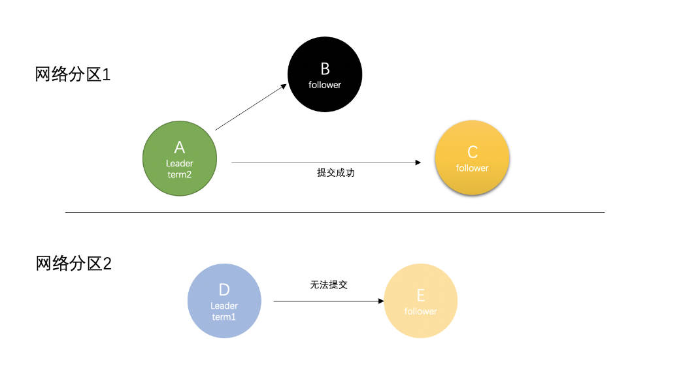
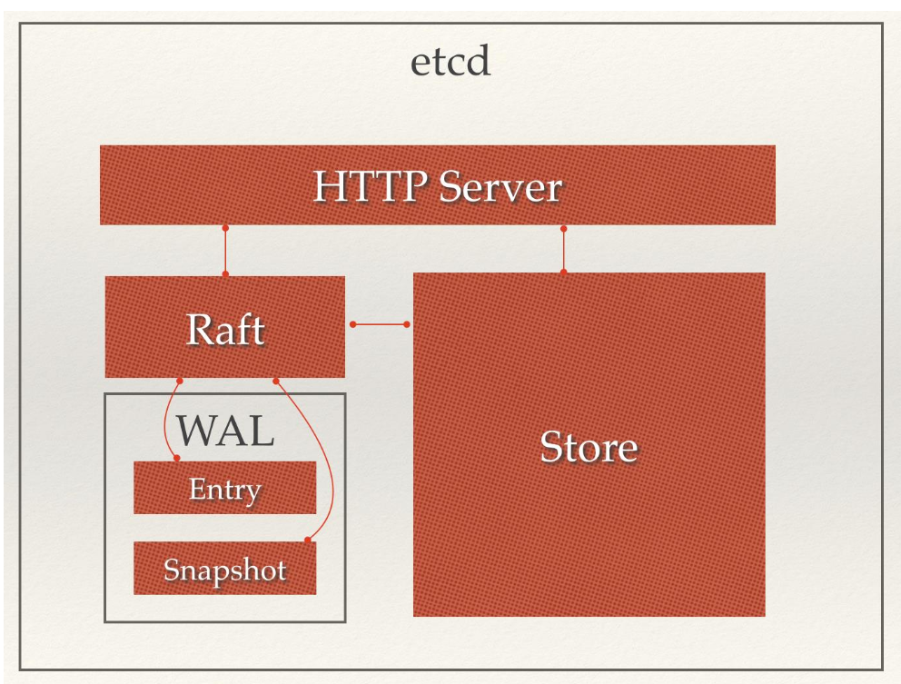

# ETCD

首先介绍Raft算法

## Raft（分布式一致性算法）

Raft 把集群中节点分为三种状态：Leader、 Follower、Candidate

- Leader（领导者）：负责日志的同步管理，处理来自客户端的请求，与Follower保持heartBeat的联系
- Follower（追随者）：响应 Leader 的日志同步请求，响应Candidate的邀票请求，以及把客户端请求到Follower的事务转发（重定向）给Leader
- Candidate（候选者）：负责选举投票，集群刚启动或者Leader宕机时，状态为Follower的节点将转为Candidate并发起选举，选举胜出（获得超过半数节点的投票）后，从Candidate转为Leader状态

为了解决数据一致性问题，将其划分为3个子问题：

1. 选举：当 Leader 宕机或者集群初创时，一个新的 Leader 需要被选举出来
2. 日志复制：Leader 接收来自客户端的请求并将其以日志条目的形式复制到集群中的其它节点，并且强制要求其它节点的日志和自己保持一致
3. 安全性：有任何的服务器节点已经应用了一个确定的日志条目到它的状态机中，那么其它服务器节点不能在同一个日志索引位置应用一个不同的指令

### 选举

- 集群最开始都是Follower，任期为0.此时启动每个节点的选举计时器，并且每个计时器的超时时间也不同
- 如果在节点选举计时器周期内没有收到心跳和投票请求，该节点转为Candidate，任期自增，向集群中所有节点发送投票请求并且重置自己选举定时器
- 投票
  - 请求节点的 Term 大于自己的 Term，且自己尚未投票给其它节点，则接受请求，把票投给它
  - 请求节点的 Term 小于自己的 Term，且自己尚未投票，则拒绝请求，将票投给自己

- 如果一个Candidate收到超过半数节点票，升级为Leader，定时发送心跳给其他节点，其他节点转为Follower并与Leader保持同步

### 日志复制

- Leader收到客户端请求，将其作为日志条目Entry记录入本地日志，该条目是未提交状态
- 随着心跳，Leader将Entry并发发送给其他Follower，让它们复制这条日志条目
  - 发送追加日志条目的时候，Leader 会把新的日志条目紧接着之前条目的索引位置， Leader 任期号也包含在其中；如果没有，Follower拒绝接收，此时说明二者不一致
  - Leader与Follower不一致？
    - leader 必须找到最后两者达成一致的地方，然后删除从那个点之后的所有日志条目，发送自己的日志给 Follower。所有的这些操作都在进行附加日志的一致性检查时完成

- Followers 接收到 Leader 发来的复制请求后，回应Leader。此时Entry仍是未提交
  - 写入本地日志中，返回 Success
  - 一致性检查失败，拒绝写入，返回 False

- Leader收到大多数Follower回应，Entry标记为提交，把这条日志条目应用到它的状态机中
- Leader向客户端回应OK
- Leader回应客户端后，将随着下一个心跳通知 Followers，Followers 收到通知后也会将 Entry 标记为提交状态

### 安全性
- 选举限制
  -  Candidate 的日志至少和大多数的服务器节点一样新，那么它一定持有了所有已经提交的日志条目。投票请求的限制中请求中包含了 Candidate 的日志信息，然后投票人会拒绝那些日志没有自己新的投票请求

- 提交之前任期内的日志条目
  - Leader 当前任期里的日志条目通过计算副本数目可以被提交；一旦当前任期的日志条目以这种方式被提交，那么由于日志匹配特性，之前的日志条目也都会被间接的提交
  - Leader 复制之前任期里的日志时，Raft 会为所有日志保留原始的任期号

### 脑裂问题

当raft在集群中遇见网络分区的时候,集群就会因此而相隔开,在不同的网络分区里会因为无法接收到原来的leader发出的心跳而超时选主,这样就会造成多leader现象

当网络恢复的时候,集群不再是双分区,raft会有如下操作：

①: leaderD发现自己的Term小于LeaderA,会自动下台(step down)成为follower,leaderA保持不变依旧是集群中的主leader角色

②: 分区中的所有节点会回滚roll back自己的数据日志,并匹配新leader的log日志,然后实现同步提交更新自身的值。通知旧leaderA也会主动匹配主leader节点的最新值,并加入到follower中

③: 最终集群达到整体一致，集群存在唯一leader（节点A）

## ETCD

一个高可用、强一致的分布式键值（Key-Value）数据库，主要用途是共享配置和服务发现。其内部采用 Raft 算法作为分布式一致性协议

- HTTP Server：用于处理客户端发送的 API 请求以及其它 Etcd 节点的同步与心跳信息请求
- Store：用于处理 Etcd 支持的各类功能的事务，包括数据索引、节点状态变更、监控与反馈、事件处理与执行等等
- Raft：Raft 强一致性算法的具体实现，是 Etcd 的核心
- WAL：Write Ahead Log（预写式日志），是 Etcd 的数据存储方式。除了在内存中存有所有数据的状态以及节点的索引，Etcd 还通过 WAL 进行持久化存储

一个用户的请求发送过来，会经由 HTTP Server 转发给 Store 进行具体的事务处理；如果涉及到节点的修改，则交给 Raft 模块进行状态的变更、日志的记录，然后再同步给别的 Etcd 节点以确认数据提交；最后进行数据的提交，再次同步

### ETCD应用场景

1. 服务发现
   1. 存在一个高可靠、高可用的中心配置节点
   2. 用户可以在 Etcd 中注册服务，并且对注册的服务配置租约，定时续约以达到维持服务的目的
   3. 服务提供方在 Etcd 指定的目录（前缀机制支持）下注册服务，服务调用方在对应的目录下查询服务。通过 Watch 机制，服务调用方还可以监测服务的变化

2. 消息发布与订阅
   1. 应用在启动时，主动从 Etcd 获取一次配置信息，同时，在 Etcd 节点上注册一个 Watcher 并等待，以后每次配置有更新，Etcd 都会实时通知订阅者，以此达到获取最新配置信息的目的

3. 分布式锁

### 通信方式
采用gRPC作为底层通信协议，而gRPC实现多路复用，一对多

protobuf作为消息传递数据格式

问题1：为什么不用json？

回答：
1. 多余内存开销。对于int类型，内存只占2字节，转为json需要5字节
2. 重复传输字段，同样的key，work，只是因为值不同，就要传输两次work这个key值

问题2：为什么采用gRPC

回答：
1. 性能： protobuf序列化字段，负载小
2. 协议：转为HTTP/2 设计，比普通的HTTP紧凑高效，单个TCP可复用多个HTTP/2 调用
3. 代码生成：.proto文件自动生成，并且端到端生成消息和客户端代码
4. 严格规范：避免多平台的情况下出现分歧，各个平台实现一致。
5. 流式处理：支持一元，服务到客户端，客户到服务端，双向流式传输
6. 超时处理支持：支持rpc内部的timeout，并且可以取消timeout的服务

## ETCD查询步骤
1. 寻找指定的key值
2. 获取全部generation版本号
3. 根据查询的generation从存储中找到具体的Value值
4. 输出Value

etcd将数据存放在一个持久化的B+树
etcd会维护一个字段序的B树索引，是为了加速针对key的范围扫描
每个B树索引项中，都存储了一个key值，这也是为了快速定位指定的key或者进行范围扫描
etcd的每个key有多个版本，在每个revision的tree里，有多个对应的keys