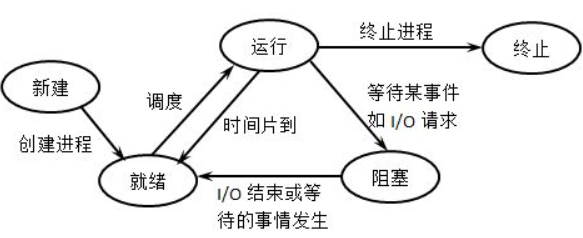
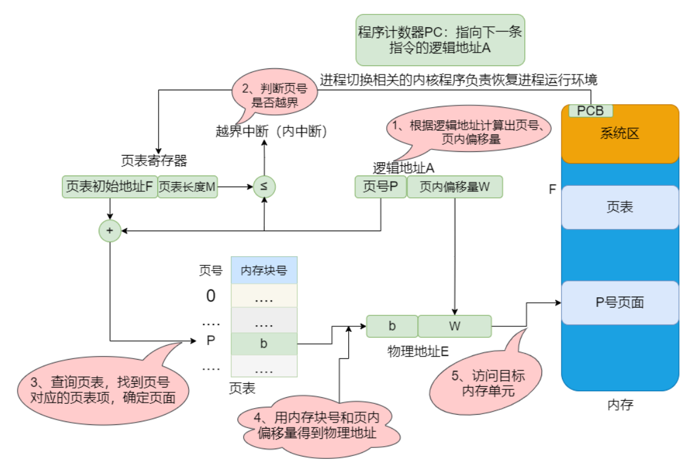

# 操作系统

## 写时拷贝

Linux程序中，fork（）会产生一个和父进程完全相同的子进程，但子进程在此后多会exec系统调用，出于效率考虑，linux中引入了“写时复制“技术，也就是只有进程空间的各段的内容要发生变化时，才会将父进程的内容复制一份给子进程

fork之后exec之前两个进程用的是相同的物理空间，虚拟空间不同。

一旦其中一个进程尝试写入某个内存页，就会触发一个保护故障（缺页异常），此时会陷入内核。内核将拦截写入，并为尝试写入的进程创建这个页面的一个新副本，恢复这个页面的可写权限，然后重新执行这个写操作，这时就可以正常执行了。


## main函数执行前干了什么

1.OS新建进程，程序执行前装载器会把用户的参数和环境变量压入栈，把控制权交给程序的入口函数（入口函数并非main，只是用来准备环境）

2.入口函数对运行库和程序运行环境进行初始化，包括堆，I/O，线程，全局变量构造（constructor）等

​	初始化静态static变量和global全局变量，即.data段的内容

​	将未初始化部分的全局变量赋初值：数值型short，int，long等为0，bool为FALSE，指针为NULL等等，即.bss段的内容

3.调用main函数，正式开始执行程序主体。

4.执行main完毕，返回入口函数，进行清理工作，包括全局变量析构，堆销毁，关闭I/O等，系统调用关掉进程


## 将“hello world”打印到屏幕的过程

检查并寻址——执行该程序main——交给系统调用

1. 操作系统：找到hello world程序的相关信息，检查其类型是否是可执行文件；并通过程序首部信息，确定代码和数据在可执行文件中的位置并计算出对应的磁盘块地址
2. 操作系统：创建一个新进程，将HelloWorld可执行文件映射到该进程结构，表示由该进程执行hello world程序
3. 操作系统：为hello world程序设置cpu上下文环境，并跳到程序开始处
4. 执行hello world程序的第一条指令，发生缺页异常
5. 操作系统：分配一页物理内存，并将代码从磁盘读入内存，然后继续执行hello world程序
6. hello word程序执行puts函数（系统调用），在显示器上写一字符串
7. 操作系统：找到要将字符串送往的显示设备，通常设备是由一个进程控制的，所以，操作系统将要写的字符串送给该进程
8. 操作系统：控制设备的进程告诉设备的窗口系统，它要显示该字符串，窗口系统确定这是一个合法的操作，然后将字符串转换成像素，将像素写入设备的存储映像区


## 从代码到可执行程序经历什么

- 预编译
  - 展开宏定义、处理头文件、所有条件预编译指令、删除所有注释
- 编译
  - 语词分析、语法分析等
  - 生成汇编代码文件
- 汇编
  - 产生目标文件
- 链接：不同的源文件产生的目标文件进行链接，从而形成一个可以执行的程序，可分为**静态链接**和**动态链接**
  - **静态链接**：静态库就是函数和数据被编译进一个二进制文件。在**使用静态库**的情况下，在编译链接可执行文件时，链接器从库中**复制**这些函数和数据并把它们和应用程序的其它模块组合起来创建最终的可执行文件
  - windows下是.lib后缀，Linux下以.a后缀
    - **符号解析**：每个符号对应于一个函数、一个全局变量或一个静态变量，符号解析的目的是将每个符号引用与一个符号定义关联起来
    - **重定位**：链接器通过把每个符号定义与一个内存位置关联起来，然后修改所有对这些符号的引用，使得它们指向这个内存位置
    - 缺点：
      - 空间浪费：每个可执行程序中对所有需要的目标文件都要有一份副本，所以如果多个程序对同一个目标文件都有依赖，会出现同一个目标文件都在内存存在多个副本
      - 更新困难：每当库函数的代码修改了，这个时候就需要重新进行编译链接形成可执行程序
    - 优点：
      - 执行的时候运行速度快

  - **动态链接**：把程序按照模块拆分成各个相对独立部分，在程序运行时才将它们链接在一起形成一个完整的程序
  - Windows下以.dll为后缀，Linux以.so后缀
    - 共享库：这多个程序在执行时共享同一份副本
      - 一个共享库的 .text 节（已编译程序的机器代码）的一个副本可以被不同的正在运行的进程共享
    - 更新方便：更新时只需要替换原来的目标文件，而无需将所有的程序再重新链接一遍。当程序下一次运行时，新版本的目标文件会被自动加载到内存并且链接起来
    - 查看程序使用哪些动态链接库
      - `ldd`命令


## 静态库与动态库区别

1. 静态库的代码在编译的过程中已经载入到可执行文件中；动态库的代码在可执行程序运行时才载入内存，在编译过程中仅简单的引用
2. 静态库链接的时候把库直接加载到程序中,而动态库链接的时候，它只是保留接口，将动态库与程序代码独立，这样就可以提高代码的可复用度和降低程序的耦合度

## 有什么工具，能查看编译后可执行文件的函数

objdump是用查看目标文件或者可执行的目标文件的构成的GCC工具

ltrace的功能是能够跟踪进程的库函数调用

strace 命令可以用于追踪程序运行过程中的系统调用及信号


## 堆与栈区别

- 申请方式不同
  - 栈由系统自动分配
  - 堆是自己申请和释放的
- 申请大小限制不同
  - 栈顶和栈底是之前预设好的，栈是向低地址扩展，大小固定
  - 堆向高地址增长，是不连续的内存区域，大小可以灵活调整
- 申请效率不同
  - 栈由系统分配，速度快，不会有碎片
  - 堆由程序员分配，速度慢，且会有碎片
- 运行速度不同
  - 操作系统会在底层对栈提供支持，会分配专门的寄存器存放栈的地址，栈的入栈出栈操作也十分简单，并且有专门的指令执行，所以栈的效率比较高也比较快
  - 堆的操作是由C/C++函数库提供的，在分配堆内存的时候需要一定的算法寻找合适大小的内存。并且获取堆的内容需要两次访问，第一次访问指针，第二次根据指针保存的地址访问内存，因此堆比较慢


## 内存池

- 由于所申请内存块的大小不定，当频繁使用时会造成大量的内存碎片并进而降低性能。
- 内存池则是在真正使用内存之前，**先申请分配一定数量的、大小相等(一般情况下)的内存块留作备用**。当有新的内存需求时，就从内存池中分出一部分内存块， 若**内存块不够再继续申请新的内存**。这样做的一个显著优点是尽量避免了内存碎片，使得内存分配效率得到提升
- 内存池设计
  - 预申请一个内存区chunk，将内存中按照对象大小划分成多个内存块block
  - 维持一个空闲内存块链表，通过指针相连，标记头指针为第一个空闲块
  - 每次新申请一个对象的空间，则将该内存块从空闲链表中去除，更新空闲链表头指针
  - 每次释放一个对象的空间，则重新将该内存块加到空闲链表头
  - 如果一个内存区占满了，则新开辟一个内存区，维持一个内存区的链表，同指针相连，头指针指向最新的内存区，新的内存块从该区内重新划分和申请

注意：**在内存分配和释放的环节需要加锁来保证线程安全**

# 进程、线程与协程区别

- 定义
  - 进程是资源调度的基本单位，运行一个可执行程序会创建一个或多个进程，进程就是运行起来的可执行程序
  - 线程是程序执行基本单位，同一进程中所有线程共享内存空间、全局变量等
  - 协程：用户态的更加轻量级线程，是一种特殊的函数，可以在某个地方被“挂起”,并且可以重新在挂起处外继续运行，通过跳转实现。
- 上下文切换
  - 进程：切换虚拟地址空间，切换栈和硬件上下文(寄存器、程序计数器等)，CPU高速缓存失效、页表切换，开销很大
  - 线程：切换时只需保存和设置少量寄存器内容，因此开销很小
  - 协程：直接操作栈则基本没有内核切换的开销，可以不加锁的访问全局变量，所以上下文的切换非常快
- 拥有资源
  - 进程：CPU、内存、文件资源和句柄
  - 线程：程序计数器、寄存器、栈和状态字
  - 协程：自己的寄存器上下文和栈

有可能问到线程的优缺点

线程上下文切换，可以详细说明线程独有和共享的数据

有栈协程、无栈协程、独立栈、共享栈

## 有栈协程、无栈协程、独立栈、共享栈

有栈协程把局部变量放在新开的空间上，无栈协程直接使用系统栈使得CPU cache局部性更好，同时也使得无栈协程的中断和函数返回几乎没有区别

通过独立栈实现的协程库中的每一个协程都有自己独立的栈空间，协程栈大小固定且互不干扰
。

通过共享栈实现的协程库中的每一个协程在运行时都使用一个公共的栈空间，当协程挂起时将自己的数据从共享栈拷贝到自己的独立栈，协程运行时又将数据从独立栈拷贝到共享栈运行


## 进程PCB内容

进程ID、进程状态、特征信息（是用户进程还是内核进程）、该进程优先级、现场保护区

## 一个进程能够最多创建多少个线程
与两个东西相关：
1. 进程虚拟内存空间上线
2. 系统参数限制
- 32 这个系统，用户态的虚拟空间只有 3G，如果创建线程时分配的栈空间是 10M，那么一个进程最多只能创建 300 个左右的线程
- 64 系统，用户态的虚拟空间大到有 128T，理论上不会受虚拟内存大小的限制，而会受系统的参数或性能限制

### 线程优缺点

- 优点
  1. 创建一个新线程的代价要比创建一个新进程小得多
  2. 与进程之间的切换相比，线程之间的切换需要操作系统做的工作要少很多线程占用的资源要比进程少很多
  3. 能充分利用多处理器的可并行数量
  4. 在等待慢速I/O操作结束的同时，程序可执行其他的计算任务
  5. 计算密集型应用，为了能在多处理器系统上运行，将计算分解到多个线程中实现
  6. I/O密集型应用，为了提高性能，将I/O操作重叠。线程可以同时等待不同的I/O操作(如边下视频边看视频)
- 缺点
  - 健壮性降低：编写多线程需要更全面更深入的考虑，在一个多线程程序里，因时间分配上的细微偏差或者因共享了；不该共享的变量而造成不良影响的可能性是很大的，换句话说线程之间是缺保护的
  - 编程难度提高：编写与调试一个多线程程序比单线程程序困难得多

### 线程共享数据
1. 堆。堆是在进程空间内开辟的，所以被共享
2. 全局变量。与某一函数无关，与特定线程无关
3. 静态变量。静态变量存放位置和全局变量一样，都存在于堆中开辟的.bss和.data段，是共享的
4. 其他一些共用资源，比如文件。

### 线程独享数据
1. 栈
2. 寄存器
3. 程序计数器


## 中断与异常
中断分为硬中断和软中断

- 硬中断
  - 由硬件设备产生的,通过中断控制器发送给CPU，接着CPU判断收到的中断来自于哪个硬件设备（这定义在内核中），最后，由CPU发送给内核，有内核处理中断
- 软中断
  - 由当前正在运行的进程所产生的。 软中断并不会直接中断CPU。这种中断是一种需要内核为正在运行的进程去做一些事情（通常为I/O）的请求
- 异常时由 CPU 执行指令的内部事件引起，如非法操作码、地址越界、算术溢出

## 系统调用
### 用户态和核心态

1. 用户态线程工作在用户空间，内核态线程工作在内核空间
2. 用户态线程调度完全由进程负责，通常就是由进程的主线程负责。相当于进程主线程的延展，使用的是操作系统分配给进程主线程的时间片段；内核线程由内核维护，由操作系统调度。
3. 用户态线程无法跨核心，一个进程的多个用户态线程不能并发，阻塞一个用户态线程会导致进程的主线程阻塞，直接交出执行权限
4. 内核线程可以独立执行，操作系统会分配时间片段。因此内核态线程更完整，也称作轻量级进程。内核态线程创建成本高，切换成本高，创建太多还会给调度算法增加压力，因此不会太多

### 系统调用过程

应用程序应该以某种方式通知系统，告诉内核自己需要执行一个系统调用，希望系统切换到内核态，这样内核就可以代表应用程序来执行该系统调用了

通知内核的机制是靠软件中断实现的。首先，用户程序为系统调用设置参数。其中一个参数是系统调用编号。参数设置完成后，程序执行“系统调用”指令。这个指令会导致一个异常：产生一个事件，这个事件会致使处理器切换到内核态并跳转到一个新的地址，并开始执行那里的异常处理程序


API函数参数压到栈上，然后将函数内调用系统调用的代码放入寄存器，通过陷入中断，进入内核将控制权交给操作系统，操作系统获得控制后，将系统调用代码拿出来，跟操作系统一直维护的一张系统调用表做比较，已找到该系统调用程序体的内存地址，接着访问该地址，执行系统调用。执行完毕后，返回用户程序

## 进程创建、退出

- 进程结构由以下几个部分组成：代码段、堆栈段、数据段。代码段是静态的二进制代码
- 父进程创建子进程，二者共享数据。后者读写数据通过**写时复制**机制将公共数据拷贝，在拷贝的数据上操作
- 进程创建
  - 计算机启动到终端执行程序
    - 0号进程 -> 1号内核进程 -> 1号用户进程(init进程) -> getty进程 -> shell进程 -> 命令行执行进程
  - 父进程调用fork生成子进程，返回两次：父进程返回子进程pid，子进程中返回0
    - 子进程继承父进程的
      - 进程权限、环境、堆栈、内存、进程组号
    - 子进程独有
      - 进程号
- 进程退出
  - exit()、_exit()、return
  - 区别
    - _exit()函数关闭全部描述符和清理函数后不会刷新流，但是exit()会在调用_exit()函数前刷新数据流，清除I/O缓冲
    - exit()是函数，但有参数，**执行完之后控制权交给系统**。return若是在调用函数中，执行完之后**控制权交给调用进程**，若是在main函数中，控制权交给系统
  - 异常退出：abort()

## 线程的等待、终止

1. 从线程函数return
2. 线程可以调用pthread_ exit终止自己
3. 线程可以调用pthread_ cancel终止同一进程中的另一个线程或者自己

注：在主线程使用return，以及在线程中使用exit都会终止整个进程


已经退出的线程，其空间没有被释放，仍然在进程的地址空间内，创建新的线程不会复用刚才退出线程的地址空间，如果主线程不对新线程进行等待，那么这个新线程的资源也是不会被回收的。如果不等待会产生**内存泄漏**

线程是用来执行分配的任务的，如果主线程想知道任务完成的怎么样，那么就有必要对线程进行等待，获取线程退出的信息


## 进程之间调度算法

- **先来先服务**
  - 有利于长作业，但不利于短作业，短作业等待时间过长
- **短作业优先**
  - 长作业因长时间无法得到调度，有可能会饿死
- **最短剩余时间优先**
  - 最短作业优先的抢占式版本，按剩余运行时间的顺序进行调度
- **时间片轮转** 
  - 所有就绪进程按 先来先服务的原则排成一个队列，每次调度时，把 CPU 时间分配给队首进程，该进程可以执行一个时间片
  - 时间片用完时，由计时器发出时钟中断，调度程序便停止该进程的执行，并将它送往就绪队列的末尾，同时继续把 CPU 时间分配给队首的进程
- **优先级调度** 


## 进程通信方式

同步是目的，通信是手段。为了能够达到进程同步的目的，需要让进程进行通信，传输一些进程同步所需要的信息

- 单机模型，有管道、内存共享、消息队列。这三个模型中，内存共享程序最难写，但是性能最高。管道程序最好写，有标准接口。消息队列程序也比较好写，比如用发布/订阅模式实现具体的程序
- 分布式模型，就有远程调用、消息队列和网络请求。直接发送网络请求程序不好写，不如直接用实现好的 RPC 调用框架。RPC 框架会增加系统的耦合，可以考虑 消息队列，以及发布订阅事件的模式，这样可以减少系统间的耦合


- 管道
  - 无名管道
    - 数据只能单向流动，而且只能在具有亲缘关系的进程之间使用。进程的亲缘关系通常是指父子进程或兄弟进程关系
      - 调用pipe创建，pipe(fd[2])：pipefd[0]是读端，pipefd[1]是写端
      - 只支持半双工，使用必须关闭其中一端
      - 仅存在内存
  - 有名管道
    - 允许在没有亲缘关系的进程之间使用
      - FIFO文件，两个进程能访问该文件就算通信
      - 依旧是半双工通信，作为文件存储系统中
      - 删除需要unlink命令
- 内存共享
  - 进程可以将同一段共享内存连接到它们自己的地址空间，多个进程可以访问同一块内存空间，**是最快的可用IPC形式**
  - 对该临界区的访问通过**信号量**实现进程同步
- 消息队列
  - 消息队列是有消息的链表，存放在内核中
  - 有足够权限的进程可以向队列中添加消息，被赋予读权限的进程则可以读走队列中的消息
- 套接字
  - 适用于不同机器间进程通信，在本地也可作为两个进程通信的方式
- 信号
  - 异常状态下，通知接收进程某个事件已经发生
- 信号量（同步原语）
  - 信号量是一个计数器，可以用来控制多个进程对共享资源的访问。它常作为一种锁机制，实现进程、线程的对临界区的同步及互斥访问
- 内存映射
  - 内存映射允许任何多个进程间通信，每一个使用该机制的进程通过把一个共享的文件映射到自己的进程地址空间来实现它
  - 
## 线程在Linux下通信（同步）的方式

线程之间的通信，主要是用于同步
- 锁
  - 互斥锁
  - 读写锁：读操作都是并行的，只有写操作是串行的
  - 自旋锁
    - 上锁受阻时线程不阻塞而是在循环中轮询查看能否获得该锁，没有线程的切换因而没有切换开销，不过对CPU的霸占会导致CPU资源的浪费
- 条件变量
  - 当某个共享数据到达某个值的时候，唤醒等待这个共享数据的线程
- 信号量
  - 上锁受阻时线程不阻塞而是在循环中轮询查看能否获得该锁，没有线程的切换因而没有切换开销，不过对CPU的霸占会导致CPU资源的浪费

- 屏障
  - 每个线程等待，直到所有的合作线程都到达某一点，然后从该点继续执行
  - 具体函数`pthread_join`，允许一个线程等待，直到另一个退出
  
### 共享内存与内存映射区别
1. 共享内存可以直接创建，内存映射需要磁盘文件
2. 共享内存效率更高
3. 内存
   1. 共享内存，所有的进程操作的是同一块共享内存
   2. 内存映射，每个进程在自己的虚拟地址空间中有一个独立的内存

4. 数据安全
   1. 进程突然退出时，共享内存还存在，内存映射区消失
   2. 运行进程的电脑死机，宕机时。在共享内存中的数据会消失。内存映射区的数据 ，由于磁盘文件中的数据还在，所以内存映射区的数据还存在。


### 信号量与互斥量区别
- 所有权
  - 一个锁住临界区的锁必须由上锁的线程解开，因此mutex的功能也就限制在了构造临界区上
  - 信号量来说，任意多线程都可以对信号量执行PV操作

- 同步与互斥
  - 互斥独占式访问某段程序和内存
  - 同步就是调度线程，即一些线程生产一些线程消费，让生产和消费线程保持合理执行顺序


## Linux内核同步方式
内核需要一些同步机制来同步各执行单元对共享数据的访问。在多处理器系统上，更需要一些同步机制来同步不同处理器上的执行单元对共享的数据的访问

1. 禁用中断
   1. 单处理器不可抢占系统来说，系统并发源主要是中断处理。因此在进行临界资源访问时，进行禁用/使能中断即可以达到消除异步并发源的目的

2. 原子操作
   1. 指令在运行时候不会被任何事物或者事件打断，把读和写的行为包含在一步中执行，避免竞争

3. 内存屏障
   1. 程序在运行时内存实际的访问顺序和程序代码编写的访问顺序不一定一致，这就是内存乱序访问
   2. 内存屏障就是一类同步屏障指令，是一个同步点，只有在此点之前的所有读写操作都执行后才可以执行此点之后的操作
      1. 编译时，编译器优化导致内存乱序访问（指令重排）
      2. 运行时，多 CPU 间交互引起内存乱序访问

4. 自旋锁。当一个线程在获取锁的时候，如果锁已经被其它线程获取，那么线程将循环等待，然后不断的判断锁是否能够被成功获取，直到获取到锁才会退出循环。


5. 信号量
   1. 在进程无法获取到临界资源的情况下，立即释放处理器的使用权，并睡眠在所访问的临界资源上对应的等待队列上；在临界资源被释放时，再唤醒阻塞在该临界资源上的进程

6. 读-写自旋锁
7. 读-写信号量
8. 顺序锁：用于读写共享数据

## 内存交互与覆盖区别

- 覆盖：把用户空间分成为一个固定区和若干个覆盖区。将经常活跃的部分放在固定区，其余部分按照调用关系分段，首先将那些即将要访问的段放入覆盖区
- 交换：系统将内存中某些进程暂时换出外存，把外存中某些已具备运行条件的进程换入内存
  - 许多进程运行且内存吃紧时进行

- 交换技术主要是在不同进程（或作业）之间进行，而覆盖则用于同一程序或进程中


## 内存动态分区分配的算法

1. **首次适应算法**
   1. 每次都从低地址开始查找，找到第–个能满足大小的空闲分区
2. **最佳适应算法**
   1. 空闲分区按容量递增次序链接。每次分配内存时顺序查找空闲分区链(或空闲分区表)，找到大小能满足要求的第一个空闲分区
   2. 缺点：导致许多小内存块剩余，产生较多外部碎片
3. **最坏适应算法**
   1. 每次分配时优先使用最大的连续空闲区
   2. 缺点：导致较大内存空闲区被迅速用完，没有足够空间存放后续的“大进程”
4. **邻近适应算法**
   1. 以地址递增的顺序排列(可排成-一个循环链表)。每次分配内存时从上次查找结束的位置开始查找空闲分区链(或空闲分区表)，找到大小能满足要求的第一个空闲分区
   2. 

所谓并发，就是同时存在着多个运行着的程序，一个单核cpu同一时刻只能运行一个程序，操作系统负责协调

多个程序交替执行，宏观上看起来是同时进行的

## 进程状态切换

- 五态模型
  - 
    
    - 创建：一个进程启动，首先进入创建状态，需要获取系统资源创建进程管理块（PCB：Process Control Block)完成资源分配。
    - 就绪状态：在创建状态完成之后，进程已经准备好，处于就绪状态，但是还未获得处理器资源，无法运行。
    - 运行状态：获取处理器资源，被系统调度，当具有时间片开始进入运行状态。如果进程的时间片用完了就进入就绪状态。
    - 阻塞状态：在运行状态期间，如果进行了阻塞的操作，此时进程暂时无法操作就进入到了阻塞状态，在这些操作完成后就进入就绪状态。等待再次获取处理器资源，被系统调度，当具有时间片就进入运行状态。
    - 终止状态：进程结束或者被系统终止，进入终止状态。
  - 就绪态和运行态可以相互转换，其它的都是单向转换。就绪状态的进程通过调度算法从而获得CPU 时间，转为运行状态；而运行状态的进程，在分配给它的 CPU 时间片用完之后就会转为就绪状态，等待下一次调度


## 线程状态切换（C++考察较少）

1. 初始状态：新创建了一个线程对象

2. 可运行状态：该状态的线程位于可运行线程池中，变得可运行，等待获取CPU的使用权

3. 运行状态：就绪状态的线程获取了CPU，执行程序代码的状态

4. 死亡状态：程执行完了或者因异常退出

5. 阻塞状态：线程因为等待监视锁而被阻塞的状态

6. 等待状态：正在等待其他线程去执行一个特定的操作

7. 超时状态：一个在限定时间内等待的线程的状态。也称之为限时等待状态

   

## 程序执行时，逻辑地址转物理地址过程

1. 在系统中设置一个页表寄存器(PTR)，存放页表在内存中的起始地址F和页表长度M。进程未执行时，页表的始址和页表长度放在进程控制块(PCB) 中，当进程被调度时，操作系统内核会把它们放到页表寄存器中
2. 逻辑地址转物理地址过程,如图

系统为每一个进程建立一张段表，每个分段有一张页表。段表表项中至少包括段号、页表长度和页表始址，页表表项中至少包括页号和块号。在进行地址转换时，首先通过段表查到页表始址，然后通过页表找到页帧号，最终形成物理地址。

简单介绍分页和分段
- 分段
   将用户程序地址空间分成若干个大小不等的段，每段可以定义一组相对完整的逻辑信息。存储分配时，以段为单位，段与段在内存中可以不相邻接，实现了离散分配。分段主要是为了使程序和数据可以被划分为逻辑上独立的地址空间并且有助于共享和保护。
- 分页
   用户程序的地址空间被划分成若干固定大小的区域，称为“页”，相应地，内存空间分成若干个物理块，页和块的大小相等。可将用户程序的任一页放在内存的任一块中，实现了离散分配。分页主要用于实现虚拟内存，从而获得更大的地址空间。
- 段页式
   页式存储管理能有效地提高内存利用率（解决内存碎片），而分段存储管理能反映程序的逻辑结构并有利于段的共享。将这两种存储管理方法结合起来，就形成了段页式存储管理方式。
   段页式存储管理方式即先将用户程序分成若干个段，再把每个段分成若干个页，并为每一个段赋予一个段名。在段页式系统中，为了实现从逻辑地址到物理地址的转换，系统中需要同时配置段表和页表，利用段表和页表进行从用户地址空间到物理内存空间的映射。


## 生产者-消费者问题（经典问题）

- 只有缓冲区没有满，生产者才可以放入物品；只有缓冲区不为空，消费者才可以拿走物品

- 使用一个互斥量 mutex 来控制生产者与消费者对缓冲区的互斥访问

- 要使用两个信号量：empty 记录空缓冲区的数量，full 记录满缓冲区的数量

-  empty 不为 0 时，生产者才可以放入物品；full 信号量是在消费者进程中使用，当 full 信号量不为 0 时，消费者才可以取走物品。

具体代码实现：

- ```c++
  #define N 100
  typedef int semaphore;
  semaphore mutex = 1;
  semaphore empty = N;
  semaphore full = 0;
  void producer() {
   	while(TRUE) {
   		int item = produce_item();
   		down(&empty);
   		down(&mutex);
   		insert_item(item);
   		up(&mutex);
   		up(&full);
   	}
  }
  void consumer() {
   	while(TRUE) {
   		down(&full);
   		down(&mutex);
   		int item = remove_item();
   		consume_item(item);
   		up(&mutex);
   		up(&empty);
   	}
  }
  ```

不论是生产者线程还是消费者线程，它们都是先申请到锁进入临界区后再判断是否满足生产或消费条件的，如果对应条件不满足，那么对应线程就会被挂起。但此时该线程是拿着锁的，为了避免死锁问题，在调用`pthread_cond_wait`函数时就需要传入当前线程手中的互斥锁，此时当该线程被挂起时就会自动释放手中的互斥锁，而当该线程被唤醒时又会自动获取到该互斥锁

## 读者-写者问题

- 允许多个进程同时对数据进行读操作，但是不允许读和写以及写和写操作同时发生

- 整型变量 count 记录在对数据进行读操作的进程数量，一个互斥量 count_mutex 用于对 count 加锁，一个互斥量 data_mutex 用于对读写的数据加锁

- ```c++
  typedef int semaphore;
  semaphore count_mutex = 1;
  semaphore data_mutex = 1;
  int count = 0;
  void reader() {
   	while(TRUE) {
   		down(&count_mutex);
   		count++;
   		if(count == 1) down(&data_mutex); // 第一个读者需要对数据进行加锁，防止写进程访问
   		up(&count_mutex);
   		read();
  		down(&count_mutex);
   		count--;
   		if(count == 0) up(&data_mutex);//最后一个读者要对数据进行解锁，防止写进程无法访问
   		up(&count_mutex);
   	}
  }
  void writer() {
   	while(TRUE) {
   		down(&data_mutex);
   		write();
   		up(&data_mutex);
   	}
  }
  ```

  

## 虚拟内存的目的

- 将主存当作辅存的高速缓存，经常活动的东西放在主存中，就像 GTA5 几十 GB 大的东西都放主存中是放不下的，因此可以高效利用主存

- 每个进程地址空间都一样，方便管理
- 避免进程破坏其他进程的地址空间

- 这些页被映射到物理内存，但不需要映射到连续的物理内存，也不需要所有页都必须在物理内存中。当程序引用到不在物理内存中的页时，由硬件执行必要的映射，将缺失的部分装入物理内存并重新执行失败的指令

面试题：
1. 可以在1G的内存中，分配成功4G的数组么？
    回答：使用虚拟内存可以。

    系统都会给每个进程分配4G的内存空间，这其实是虚拟内存空间。进程得到的这4G虚拟内存，进程自身以为是一段连续的空间，而实际上，通常被分隔成多个物理内存碎片，还有一部分存储在外部磁盘存储器上，需要的时候进行数据交换

## 虚拟内容如何工作
- 当每个进程创建的时候，内核会为进程分配4G的虚拟内存，只是建立好虚拟内存和磁盘文件之间的映射。数据和代码在磁盘上，运行到对应的程序，寻找页表，若不在内存上，缺页异常
- 进程运行过程中，要通过malloc来动态分配内存时，也只是分配了虚拟内存

## 虚拟内容分布如何：

.init：程序初始化代码
.text：已编译的机器代码
.rodata：只读数据。字符串字面量、全局常量等
.data：已初始化全局和静态变量
.bss段：未初始化或初始化0的全局和静态变量，占位符，不占空间

## 虚拟内存优点

- 进程运行过程中，要通过malloc来动态分配内存时，也只是分配了虚拟内存
- 当不同的进程使用同一段代码时，比如库文件的代码，在物理内存中可以只存储一份这样的代码，不同进程只要将自己的虚拟内存映射过去就好了，这样可以节省物理内存
- 在程序需要分配连续空间的时候，只需要在虚拟内存分配连续空间，而不需要物理内存时连续的，实际上，往往物理内存都是断断续续的内存碎片。这样就可以有效地利用我们的物理内存

## 介绍几种典型的锁

1. 读写锁
   1. 多个读者可以同时进行读
   2. 写者必须互斥（只允许一个写者写，也不能读者写者同时进行）
   3. 写者优先于读者（一旦有写者，则后续读者必须等待，唤醒时优先考虑写者）
2. 互斥锁
   1. 一次只能一个线程拥有互斥锁，其他线程只有等待
3. 条件变量
   1. 当条件不满足时，线程往往解开相应的互斥锁并阻塞线程然后等待条件发生变化。一旦其他的某个线程改变了条件变量，他将通知相应的条件变量唤醒一个或多个正被此条件变量阻塞的线程
4. 自旋锁
   1. 如果进线程无法取得锁，进线程不会立刻放弃CPU时间片，而是一直循环尝试获取锁，直到获取为止。
   2. 在用自旋锁时有可能造成死锁，当递归调用时有可能造成死锁


## 守护进程、僵尸进程和孤儿进程

- 守护进程：在后台运行的，没有控制终端与之相连的进程。它独立于控制终端，周期性地执行某种任务

- 孤儿进程：父进程退出，而它的一个或多个子进程还在运行，那么那些子进程将成为孤儿进程。孤儿进程将被init进程(进程号为1)所收养，并由init进程对它们完成状态收集工作

- 僵尸进程：**一个进程使用fork创建子进程，如果子进程退出，而父进程并没有调用wait或waitpid获取子进程的状态信息，那么子进程的进程描述符仍然保存在系统中**，子进程称为僵尸进程

  - 如何避免
    - 父进程调用wait/waitpid等函数等待子进程结束
    - 父进程通过signal(SIGCHLD, SIG_IGN)通知内核对子进程的结束不关心，由内核回收


## 局部性原理

- 时间局部性:如果执行了程序中的某条指令，那么不久后这条指令很有可能再次执行;如果某个数据被访问过，不久之后该数据很可能再次被访问
- 空间局部性:一旦程序访问了某个存储单元，在不久之后，其附近的存储单元也很有可能被访问


## C/C++编译的程序占用的内存分区

1. 栈：由编译器自动分配释放，存放函数的参数值，局部变量的值等
2. 堆：一般由程序员分配释放，若程序员不释放，程序结束时可能由OS回收
3. 未初始化的数据.bss段：未初始化的全局变量和未初始化的静态变量
4. 已初始化的数据.data段：初始化的全局变量和静态变量
5. 代码段.text段


## 抖动现象

- 刚刚换出的页面马上又要换入内存，刚刚换入的页面马上又要换出外存，
- 产生抖动的主要原因是进程频繁访问的页面数目高于可用的物理块数(分配给进程的物理块不够)


## 并发与并行

- 并发是指宏观上在一段时间内能同时运行多个程序，需要硬件支持，如多流水线、多核处理器或者分布式计算系统
- 而并行则指同一时刻能运行多个指令


## 页面置换算法

- **最佳置换法**
  - 每次选择淘汰的页面将是以后永不使用，或者在最长时间内不再被访问的页面
- **先进先出置换算法**
  - 每次选择淘汰的页面是最早进入内存的页面
- **最近最久未使用置换算法**
  - 每次淘汰的页面是最近最久未使用的页面
- **时钟置换算法**


## 死锁

### 1.什么是死锁

- 死锁是指两个（多个）线程相互等待对方数据的过程，死锁的产生会导致程序卡死，不解锁程序将永远无法进行下去

### 2.产生原因（必要条件）

- **互斥条件**：进程对所需求的资源具有排他性，若有其他进程请求该资源，请求进程只能等待。
- **不剥夺条件**：进程在所获得的资源未释放前，不能被其他进程强行夺走，只能自己释放
- **请求和保持条件**：进程当前所拥有的资源在进程请求其他新资源时，由该进程继续占有
- **循环等待条件**：存在一种进程资源循环等待链，链中每个进程已获得的资源同时被链中下一个进程所请求

### 3.死锁处理

- 鸵鸟策略（忽略死锁
- 死锁恢复
  - 抢占恢复
  - 回滚恢复
  - 杀死进程恢复
- 死锁预防
  - 破坏四个条件之一
- 死锁避免
  - 银行家算法

- 死锁解决
  - 多次检查，避免重复加锁
  - 资源访问结束后一定解锁，或是访问时使用trylock()，后者加锁失败时返回错误号


## 多线程与多进程使用场景

- 频繁修改：需要频繁创建和销毁的优先使用**多线程**
- 计算量：需要大量计算的优先使用**多线程** 因为需要消耗大量CPU资源且切换频繁，所以多线程好一点
- 相关性：任务间相关性比较强的用**多线程**，相关性比较弱的用多进程。因为线程之间的数据共享和同步比较简单
- 可能要扩展到多机分布的用**多进程**，多核分布的用**多线程**


## 服务器高并发，如何缓解

- 应用数据与静态资源分离：
  - 静态资源（图片，视频，js，css等）单独保存到专门的静态资源服务器中，在客户端访问的时候从静态资源服务器中返回静态资源，从主服务器中返回应用数据
- 客户端缓存
  - 把网站上的页面尽可能用静态的来实现，在页面过期或者有数据更新之后再将页面重新缓存。或者先生成静态页面，然后用ajax异步请求获取动态数据
- 反向代理
  - 在访问服务器的时候，服务器通过别的服务器获取资源或结果返回给客户端


## 执行malloc申请内存，OS怎么做

- malloc是通过两个系统调用来实现的： brk和mmap
  - brk是将进程数据段(.data)的最高地址指针向高处移动，这一步可以扩大进程在运行时的堆大小，分配内存小于128KB
  - mmap是在进程的虚拟地址空间中寻找一块空闲的虚拟内存，这一步可以获得一块可以操作的堆内存，大于128KB

虚拟内存
  
可用的内存块连接为一个长长的列表的所谓空闲链表（Free List）。调用malloc函数时，它沿连接表寻找一个大到足以满足用户请求所需要的内存块(根据不同的算法而定（将最先找到的不小于申请的大小内存块分配给请求者，将最合适申请大小的空闲内存分配给请求者，或者是分配最大的空闲块内存块）。然后，将该内存块一分为二（一块的大小与用户请求的大小相等，另一块的大小就是剩下的字节）。接下来，将分配给用户的那块内存传给用户，并将剩下的那块（如果有的话）返回到连接表上

如果空闲链表过长，说明内存碎片太多，或是划分内存块时的区块大小没有选择恰当。


## “伪共享”

当多线程修改互相独立的变量时，如果这些变量共享同一个缓存行，就会无意中影响彼此的性能，这就是伪共享

如何避免：

在 Linux 内核中存在` __cacheline_aligned_in_smp `宏定义，是用于解决伪共享的问题

## 多级cache

当cache中没有缓存我们想要的数据的时候，依然需要漫长的等待从主存中load数据。为了进一步提升性能，引入多级cache。前面提到的cache，称之为L1 cache（第一级cache）。我们在L1 cache 后面连接L2 cache，在L2 cache 和主存之间连接L3 cache。等级越高，速度越慢，容量越大


CPU缓存速度<1 ns

L1 cache 1ns

L2 cache 3ns

L3 cache 12ns

内存 65ns

## 线程池

- 概念
  1. 线程池是一种线程使用模式
  2. 线程池不仅能够保证内核的充分利用，还能防止过分调度。可用线程数量应该取决于可用的并发处理器、处理器内核、内存、网络sockets等的数量
- 使用场景
  - 需要大量的线程来完成任务，且完成任务的时间比较短
  - 对性能要求苛刻的应用，但不至于使服务器因此产生大量线程的应用

## STL锁与线程安全

- STL中的容器不是线程安全的
  - STL 的设计初衷是将性能挖掘到极致，而一旦涉及到加锁保证线程安全，会对性能造成巨大的影响而且对于不同的容器，加锁方式的不同，性能可能也不同(例如hash表的锁表和锁桶)，因此 STL 默认不是线程安全
  - 如果需要在多线程环境下使用，往往需要调用者自行保证线程安全
- 智能指针是否为线程安全
  - 对于 unique_ptr, 由于只是在当前代码块范围内生效, 因此不涉及线程安全问题
  - 对于 shared_ptr, 多个对象需要共用一个引用计数变量, 所以会存在线程安全问题. 但是标准库实现的时候考虑到了这个问题, 基于原子操作(CAS)的方式保证 shared_ptr 能够高效, 原子的操作引用计数

## 操作系统的锁分两大类

悲观锁：在每次取数据时，总是担心数据会被其他线程修改，所以会在取数据前先加锁（MySQL的读锁，写锁，行锁等），当其他线程想要访问数据时，被阻塞挂起。(互斥锁和自旋锁属于该类)

乐观锁：每次取数据时候，总是乐观的认为数据不会被其他线程修改，因此不上锁。但是在更新数据前，会判断其他数据在更新前有没有对数据进行修改。主要采用两种方式：版本号机制和CAS操作（比较和置换）
1. 版本号机制
   1. 取出记录时，获取当前version
   2. 更新时，带上这个version
   3. 执行更新时， set version = newVersion where version = oldVersion
   4. 如果version不对，就更新失败

2. CAS算法

当多个线程尝试使用CAS同时更新同一个变量时，只有其中一个线程能更新变量的值，而其它线程都失败，失败的线程并不会被挂起，而是被告知这次竞争中失败，并可以再次尝试

自旋锁：对于占用互斥锁的时间长短来决定是否选择使用自旋锁，如果占用锁时间长那么不用自旋锁，让线程进行挂起等待就好；如果占用时间短，使用自旋锁进行间断性获取锁申请，也就是自旋

实现：
      1.  传统自旋锁本质是用一个整数来表示，值为1代表锁未被占用，为0或者为负数表示被占用
      2.  单处理机环境中，特定的原子级汇编指令swap和test_and_set实现进程互斥，中断只能发生在两条机器指令之间，而同一指令内的多个指令周期不可中断，从而保证swap指令或test_and_set指令的执行不会交叉进行
      3.  多处理器环境中利用test_and_set指令实现进程互斥，在执行test_and_set指令前锁住总线，在执行test_and_set指令后释放总线，即可保证test_and_set指令执行的原子性

## 同步与互斥

- 基本概念

  - 临界资源：多线程执行流共享的资源就叫做临界资源
  - 临界区：每个线程内部，访问临界资源的代码，就叫做临界区
  - 互斥：任何时刻，互斥保证有且只有一个执行流进入临界区，访问临界资源，通常对临界资源起保护作用
  - 原子性：不会被任何调度机制打断的操作，该操作只有两态，要么完成，要么未完成

- 同步遵循的原则
  - 空闲让进，当无进程处于临界区时，表明临界资源处于空闲状态，应允许一个请求进入临界区的进程立即进入自己的临界区，以有效的利用临界资源
  - 忙则等待，当已有进程进入临界区时，表明临界资源正在被访问，因而其他视图进入临界区的进程必须等待，以保证对临界资源的互斥访问
  - 有限等待，对要求访问临界资源的进程 ，应保证在有限时限内能进入自己的临界区，以免陷入死等状态
  - 让权等待，当进程不能进入自己的临界区时，应立即释放处理机，以免进程陷入忙等状态

- 进程同步实现机制
  - 提高临界区代码执行中断的优先级
  - 自旋锁
  - 信号量机制

- 进程同步问题
  - 生产者-消费者
  - 读者-写者


## 除了锁，还有哪些并发控制方法

目的是达到同步。

乐观锁：比如Git。将结果先存在本地，然后都可以向远程仓库提交，如果没有版本冲突，就可以提交上去。这就是一种典型的乐观锁的场景，或者称为基于版本控制的场景
  - 转到乐观锁实现


Lock-Free队列：是基于 cas 指令实现的，允许多个线程使用这个队列

ThreadLocal：每个线程访问不同的资源，旨在用空间换时间，也是避免锁的一种方案


