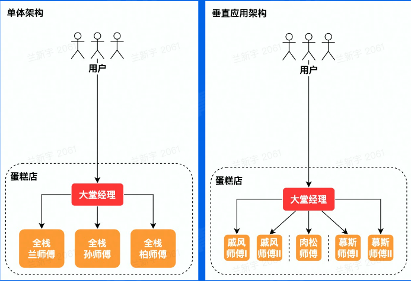

# 架构介绍
## 单机架构
将所有功能都实现在一个进程里，部署在一台机器上
- 优点
  - 简单

- 缺点
  - C10M、C10B等问题
  - 运维需要停服

## 单体架构
进程部署在多个机器上，引入负载均衡.
将不同应用代码拆分，来到垂直架构

- 优点
  - 水平扩容
  - 运维不需要停服

- 缺点
  - 职责太多，开发效率低
  - 单个业务的上线、变更会影响其他不涉及的场景

## SOA、微服务
概念：
1. 服务：根据功能抽象出来
2. 通信标准：服务之间通信的基石

中心化
去中心化：微服务架构