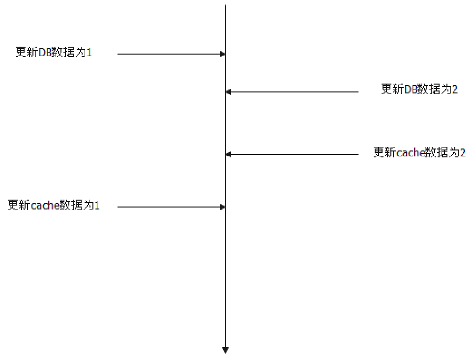
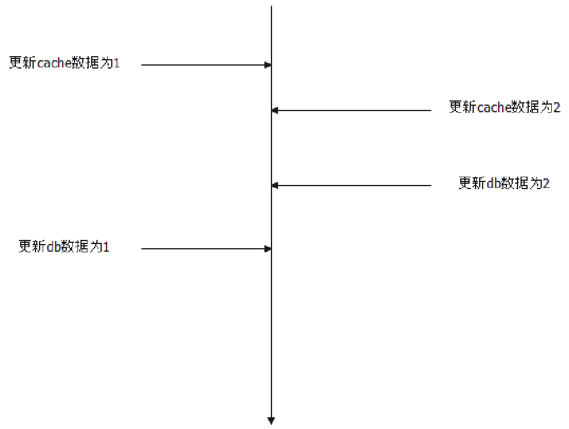
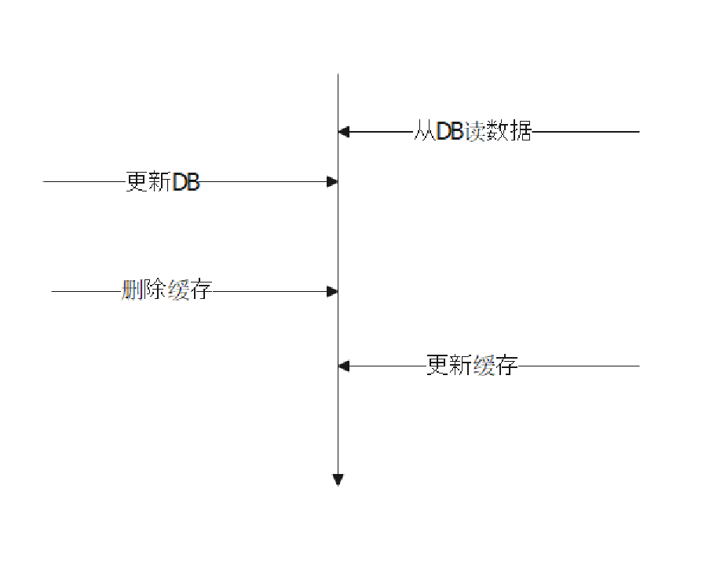

# 缓存

缓存，其目的就是能够处理大量需求。

解析：缓存的面试其实分成两大块：
- 缓存的基本理论
- 缓存中间件的应用

这里我们讨论缓存的一些基本理论，缓存中间件 Redis 等，在对应的中间件章节里面看里面查看。

将数据缓存在Redis中，也就是存在了内存中。内存天然支持高并发访问。可以瞬间处理大量请求

缓存的基本理论，目前来说考察比较多的是：
- 缓存和 DB 一致性的问题
- 缓存模式
- 缓存穿透、缓存击穿、缓存雪崩

### 缓存和 DB 一致性问题

缓存一致性的问题根源于两个原因：
- 不同线程并发更新 DB 和数据库；
- 即便是同一个线程，更新 DB 和更新缓存是两个操作，容易出现一个成功一个失败的情况；

缓存和 DB 一致性的问题可以说是无最优解的。无论选择哪个方案，总是会有一些缺点。

最常用的是三种必然会引起不一致的方案。

1. 先更新 DB，再更新缓存。不一致的情况：
   1. A 更新 DB，DB中数据被更新为1
   2. B 更新 DB，DB中数据被更新为2
   3. B 更新缓存，缓存中数据被更新为2
   4. A 更新缓存，缓存中数据被更新为1
   5. 此时缓存中数据为1，而DB中数据为2。这种不一致会一直持续到缓存过期，或者缓存和DB再次被更新，并且被修改正确；

1. 先更新缓存，再更新 DB。不一致的情况；
   1. A 更新缓存，缓存中数据被更新为1
   2. B 更新缓存，缓存中数据被更新为2
   3. B 更新 DB，DB中数据被更新为2
   4. A 更新 DB，DB中数据被更新为1
   5. 此时缓存中数据为2，但是DB 中数据为1。这种不一致会一直持续到缓存过期，或者缓存和DB再次被更新，并且被修改正确；

1. 先更新 DB，再删除缓存。不一致的情况；
   1. A 从数据库中读取数据1
   2. B 更新数据库为2
   3. B 删除缓存
   4. A 更新缓存为1
   5. 此时缓存中数据为1，数据库中数据为2

所以本质上，没有完美的解决方案，或者说仅仅考虑这种更新顺序，是不足以解决缓存一致性问题的。

与这三个类似的一个方案是利用 CDC 接口(**即变化数据捕获接口**)，异步更新缓存。但是本质上，也是要忍受一段时间的不一致性。比如说典型的，应用只更新 MySQL，然后监听 MySQL 的 binlog，更新缓存。

而如果需求强一致性的话，那么比较好的方案就是：
- 第一个是负载均衡算法结合singleflight
- 第二个是分布式锁。

第一个方案。我们可以考虑对 key 采用哈希一致性算法来作为负载均衡算法，那么我们可以确保，同一个 key 的请求，永远会落到同一台实例上。然后结合单机 singleflight，那么可以确保永远只有一个线程更新缓存或者 DB，自然就不存在一致性问题了。

这个方案要注意的是在哈希一致性算法因为扩容，或者缩容，或者重新部署，导致 key 迁移到别的机器上的时候，会出现问题。假设请求1、2都操作同一个 key：
- 请求1被路由到机器 C 上
- 扩容，加入了 C1 节点
- 请求2被路由到了 C1 节点上
- （以先写DB为例）请求1更新DB
- 请求2更新DB，请求2更新缓存
- 请求1更新缓存

在这种情况下。那么可能的解决方案就是：
- 要么在部署 C1 之前，在 C 上禁用缓存
- 要么在部署 C1 之后，先不使用缓存，在等待一段时间之后，确保 C 上的迁移key的请求都被处理完了，C1 再启用缓存

这里，也就是只有三个选项：
- 追求强一致性，选用分布式事务；
- 追求最终一致性，可以引入重试机制；
  - 同步重试：在上次请求失败或超时，程序再次发起同步调用请求
  - 异步重试：通过异步系统(消息队列或调度中间件)对失败或超时请求再次发起调用
- 如果可以使用本地事务，那么应该是：开启本地事务-更新DB-更新缓存-提交事务

### 缓存模式

缓存模式主要是所谓的 cache-aside, read-through, write-through, write-back, refresh ahead 以及更新缓存使用到的 singleflight 模式。
- cache-aside：应用直接去缓存中找数据，命中缓存则直接返回，如果未命中缓存，则需要先去数据库中查询数据，并将查询到的数据存储到缓存中
- read-through：通过应用程序来更新缓存中的数据，存在缓存中数据与数据库中数据不一致的情况；需要和write-through搭配解决
- write-through：先将数据写入到缓存中，然后由缓存将数据存入到数据库中
- write-back：标准的 write-back 是在缓存过期的时候，然后再将缓存刷新到 DB 里面。因此，它的**弊端**就是，在缓存刷新到 DB 之前，如果缓存宕机了，比如说 Redis 集群崩溃了，那么数据就永久丢失了；但是**好处**就在于，因为过期才把数据刷新到 DB 里面，因为读写都操作的是缓存。如果缓存是 Redis 这种集中式的，那么意味着大家读写的都是同一份数据，也就没有一致性的问题。但是，如果你设置了过期时间，那么缓存过期之后重新从数据库里面加载的同时，又有一个线程更新缓存，那么两者就会冲突，出现不一致的问题；
- refresh ahead：在缓存过期之前，自动刷新（重新加载）最近访问过的条目。甚至可以通过预加载来减少延迟，但如果预测不准反而会导致性能下降

### 缓存塞满解决方法

- LRU：将最近没有用到的数据剔除出去
- LFU：根据使用频率，将最不常用的数据剔除出去

### 缓存异常场景

缓存穿透、击穿和雪崩，其实，这三个就是描述了三种场景：
- 你数据库本来就没数据
- 你数据库有，但是缓存里面没有
- 你缓存本来有，但是突然一大批缓存集体过期了

  - 缓存穿透：数据库本来就没数据，所以请求来的时候，肯定是查询数据库的。但是因为数据库里面没有数据，所以不会刷新回去，也就是说，缓存里面会一直没有。因此，如果有一些黑客，一直发一些请求，这些请求都无法命中缓存，那么数据库就会崩溃。

   - 缓存击穿：如果数据库有，但是缓存里面没有。理论上来说，只要有人请求数据，就会刷新到缓存里面。问题就在于，如果突然来了一百万个请求，一百万个线程都尝试从数据库捞数据，然后刷新到缓存，那么数据库也会崩溃。

   - 缓存雪崩：缓存本来都有，但是过期了。一般情况下都不会有问题，但是如果突然之间几百万个 key 都过期了，那么接下来的请求也几乎全部命中数据库，也会导致数据库崩溃。

### 缓存解决方案
- 缓存预热：系统上线后，将相关的缓存数据直接加载到缓存系统。这样就可以避免在用户请求的时候，先查询数据库，然后再将数据缓存的问题。用户会直接查询事先被预热的缓存数据
- 缓存更新：定时去清理过期的缓存；有用户请求过来时，再判断这个请求所用到的缓存是否过期，过期的话就去底层系统得到新数据并更新缓存
- 缓存降级：访问量剧增、服务出现问题（如响应时间慢或不响应）或非核心服务影响到核心流程的性能时，仍然需要保证服务还是可用的，即使是有损服务。系统可以根据一些关键数据进行自动降级
## 面试题

### 如何解决缓存和 DB 的一致性问题

缓存和 DB 的一致性问题，没有什么特别好的解决方案，主要就是一个取舍的问题。

如果能够忍受短时间的不一致，那么可以考虑只更新 DB，等缓存自然过期。大多数场景其实没有那么强的一致性需求，这样做就够了。

进一步也可以考虑先更新 DB 再更新缓存，或者先更新缓存再更新 DB，或者更新 DB 之后删除缓存，都会有不一致的可能，但是至少不会比只更新 DB 更差。

另外一种思路是利用 CDC 接口，比如说监听 MySQL 的binlog，然后更新缓存。应用是只更新 MySQL，丝毫不关心缓存更新的问题。（引导面试官问 CDC 问题，或者 MySQL binlog，或者说这种模式和别的思路比起来有什么优缺点）

         - CDC捕获到数据库的变更之后，会将变更事件发布到消息队列中供消费者消费，诸如Kafka。只需要订阅消息队列中内容，便实现功能。

如果追求强一致性，那么可行的方案有两个：
- 利用分布式锁。在读上没必要加锁，在写的时候加锁。（在同一个时刻，有人更新数据，有人读数据，那么读的人，读到哪个数据都是可以的。如果写已经完成，那么读到的肯定是新数据，如果写没有完成，读到的肯定是老数据）。（刷亮点）一种可行的优化方案，是在单机上引入 singleflight。那么更新某个 key 的时候，同一个实例上的线程自己竞争一下，决出一个线程去参与抢全局分布式锁。在写频繁的时候，这种优化能够有些减轻分布式锁的压力。
- 另外一个方案是利用负载均衡算法和 singleflight。可以选择一种负载均衡算法，即一个 key 只会被路由到同一个实例上。比如说使用一致性哈希算法。结合 singleflight，那么可以确保全局只有一个线程去更新数据，那么自然就不存在一致性的问题了。（在扩容缩容，或者重启的时候，会有问题。要是面试官水平不高，他是意识不到的）
   
  - 这种方案的问题在于，在扩容、缩容、或者重启的时候，因为会引起 key 迁移到别的实例上，所以可能出现不一致的问题。在这种情况下，可以考虑两种方案。第一种方案是扩容或者缩容的时候在原本实例上禁用这些迁移 key 的缓存；另外一种方案是目标实例先不开启读这些迁移 key 的缓存，等一小段时间，确保原本实例上的这些迁移 key 的请求都被处理完了，然后再开启缓存。

#### 类似问题
- 在使用了缓存的时候，你先更新缓存还是先更新 DB
- 要是先更新缓存成功，再更新 DB 失败会怎样
- 要是先更新DB成功，但是更新缓存失败会怎样
- 更新 DB 之后，删除缓存的做法有什么弊端？怎么解决这种弊端？
  
### singleflight 是什么
singleflight 是一种设计模式，使用这种设计模式，可以在我们更新缓存的时候，控制住只有一个线程去更新缓存。

不过，这里面强调的一个线程只是指同一个 key 只会有一个线程。因为我们并不会说更新不同的 key 也共享一个更新线程。

（亮点，要解释 singleflight 只在单机层面上，而不是在全局上）另外一个是，在分布式环境下，我们只做单机层面上的控制。也就是说，如果有多台机器，我们会保证一个机器只有一个线程去更新特定一个 key 的缓存。比如说，针对 key1，如果有三台机器，那么最多会有三个线程去更新缓存。

不做全局的原因很简单，在分布式环境下，数据库至少要能撑住这种多台机器同时发起请求的负载。而做全局的 singleflight 本质上就是利用分布式锁，这个东西非常消耗性能。

（如果是 Go 语言）在 Go 上，标准库直接提供了 singleflight 的支持。（这里要防面试官让你手写一个）

#### 类似问题
- 为什么用 singleflight
- 为什么 singleflight 只在单机层面上应用
- 如果要在全局层面上应用 singleflight，怎么搞？其实就是加一个分布式锁，没什么花头
