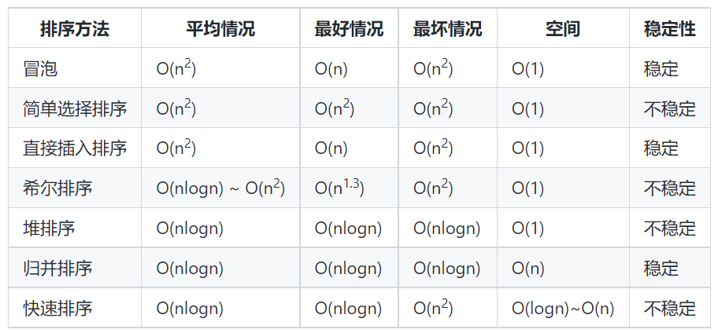

# 排序算法

- 比较排序，时间复杂度`O(nlogn) ~ O(n^2)`，主要有：冒泡排序，选择排序，插入排序，归并排序，堆排序，快速排序等。
- 非比较排序，时间复杂度可以达到O(n)，主要有：计数排序，基数排序，桶排序等。

时间复杂度

所谓稳定排序：排序前后两个相等数的相对顺序不变

## 冒泡排序

从数组中第一个数开始，依次遍历数组中的每一个数，通过相邻比较交换，每一轮循环下来找出剩余未排序数的中的最大数并"冒泡"至数列的顶端

- 最好的情况：如果待排序数据序列为正序，则一趟冒泡就可完成排序，排序码的比较次数为 n-1 次，且没有移动，时间复杂度为O(n)

- 最坏的情况：如果待排序数据序列为逆序，则冒泡排序需要 n-1 次趟起泡，每趟进行n-i次排序码的比较和移动，即比较和移动次数均达到最大值

## 选择排序

 从所有记录中选出最小的一个数据元素与第一个位置的记录交换；然后在剩下的记录当中再找最小的与第二个位置的记录交换，循环到只剩下最后一个数据元素为止。

## 插入排序

### 直接插入

原理： 从待排序的n个记录中的第二个记录开始，依次与前面的记录比较并寻找插入的位置，每次外循环结束后，将当前的数插入到合适的位置。

最好情况：当待排序记录已经有序

最坏情况：如果待排序记录为逆序

## 希尔排序

Shell排序法是对相邻指定距离(称为增量)的元素进行比较，并不断把增量缩小至1，完成排序。

在直接插入排序的基础上，将直接插入排序中的1全部改变成增量d即可，因为Shell排序最后一轮的增量d就为1。

## 快速排序

本质是分治

**算法原理**

（1）从待排序的 n 个记录中任意选取一个记录（通常选取第一个记录）为分界值；
（2）把所有小于分界值的记录移动到左边，把所有大于分界值的记录移动到右边，中间位置填分界值，称之为第一趟排序；
（3）然后对前后两个子序列分别重复上述过程，直到所有记录都排好序。

最好的情况：是每趟排序结束后，每次划分使两个子文件的长度大致相等，时间复杂度为O(nlog2n)

最坏的情况：是待排序记录已经排好序，第一趟经过n-1次比较后第一个记录保持位置不变，并得到一个n-1个元素的子记录；第二趟经过n-2次比较，将第二个记录定位在原来的位置上，并得到一个包括n-2个记录的子文件

### 优化

1. 固定位置：取序列的第一个或最后一个元素作为基准，如果数组已经有序时，此时为最坏情况，时间复杂度O(n^2)
2. 取待排序列中任意一个元素作为基准
   1. 在整个数组数字全相等时，仍然是最坏情况，时间复杂度是O(n^2）。实际上，随机化快速排序得到理论最坏情况的可能性仅为1/(2^n）。所以随机化快速排序可以对于绝大多数输入数据达到O(nlogn）的期望时间复杂度。

3. 三数取中：一组序列的中值（中位数）是枢纽元最好的选择（因为可以将序列均分为两个子序列，归并排序告诉我们，这时候是O(NlogN）；但要计算一组数组的中位数就比较耗时，会减慢快排的效率。但可以通过计算数组的第一个，中间位置，最后一个元素的中值来代替。

## 堆排序

堆是完全二叉树

最坏情况：如果待排序数组是有序的，仍然需要 O(N * logN) 复杂度的比较操作，只是少了移动的操作

最好情况：如果待排序数组是逆序的，不仅需要O(N * logN)复杂度的比较操作，而且需要O(N * logN)复杂度的交换操作。总的时间复杂度还是O(N * logN)。

堆排序一般优于快速排序的重要一点是，数据的初始分布情况对堆排序的效率没有大的影响

## 归并排序

堆排序一般优于快速排序的重要一点是，数据的初始分布情况对堆排序的效率没有大的影响

最坏、最好和平均时间复杂度都是 O(nlgn)

## 计数排序

算法步骤：
（1）找出待排序的数组中最大的元素 k，申请一个长度为 k + 1 的中间数组 C。
（2）遍历待排序数列，统计每个值为 i 的元素出现的次数，存入数组 C 的第 i 项。
（3）对所有的计数累加（从 C 中的第一个元素开始，每一项和前一项相加）。
（4）反向填充目标数组：将每个元素i放在新数组的第 C(i) 项，每放一个元素就将 C(i) 减去 1。

要求： 待排序数中最大数值不能太大。

## 基数排序

透过键值的部分信息，将要排序的元素分配至某些“桶”中，藉以达到排序的作用。

## 桶排序

首先要假设待排序的元素输入符合某种均匀分布，例如数据均匀分布在[ 0,1）区间上，则可将此区间划分为10个小区间，称为桶，对散布到同一个桶中的元素再排序。

排序过程：
（1）设置一个定量的数组当作空桶子；
（2）寻访序列，并且把记录一个一个放到对应的桶子去；
（3）对每个不是空的桶子进行排序。
（4）从不是空的桶子里把项目再放回原来的序列中。