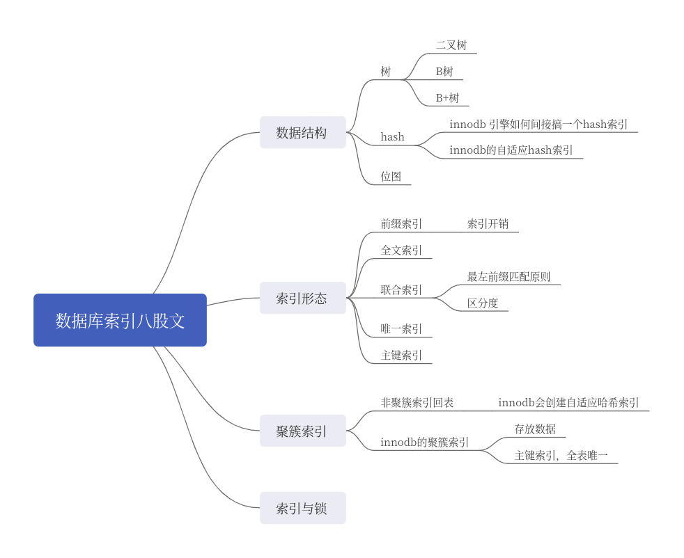

# 数据库索引

基本回答：

索引是为了加快数据查询的一种数据结构。

从**数据结构**角度出发，索引分为**B树索引**，**B+树索引**，**哈希索引**和**位图索引**。
在MySQL上，主要是采用B+树索引，B树索引在NoSQL上使用较多，哈希索引在KV数据库上较为常见。

从**形态**上来说，可以分成覆盖索引，前缀索引，全文索引，联合索引，唯一索引和主键索引。（下面的定义，可以直接一股脑说出来，也可以等面试官问）
1. 覆盖索引指索引的叶子结点已经包含了需要查询的数据，这样就没必要根据主键进行二次回表查询
2. 前缀索引是指只利用了数据前几个字符的索引，如果前面几个字符区分度不好的话，不建议使用前缀索引；
3. 全文索引现在比较少用，一般推荐使用别的中间件来完成，例如ES（小心这一步，可能咔嚓把话题引过去了ES上）；
4. 联合索引是指多个列组成一个索引。创建的时候我们会考虑把区分度好的索引放在前面，因为MySQL遵循最左前缀匹配原则；（这里可能会问你啥是最左前缀匹配原则）
5. 唯一索引是指数据库里面要求该索引值必须要唯一，我们一般用于业务唯一性保证；
6. 主键索引是比较特殊的索引，一般它的叶子节点要么存储了数据，要么存储了指向数据的指针。MySQL的innodb引擎存储的是数据，MyISAM放的是数据的地址；（这里也会引过去聚簇索引与非聚簇索引）

从是否存储数据的角度，又可以分为聚簇索引和非聚簇索引，MySQL的主键就是聚簇索引，每张表唯一一个，非聚簇索引的数据本质上存储的是主键。（面试官可能从这里被引导过去聚簇索引与非聚簇索引）

而对于MySQL的innodb来说，它的行锁是利用索引来实现的，所以如果查询的时候没有索引，那么会导致表锁。（这一句可能引导面试官问你锁和事务的问题，如果不熟悉锁和事务，请不要回答）。

## 扩展点

### 为什么使用索引
1. 通过过创建唯一性索引，可以保证数据库表中**每一行数据的唯一性**
2. 可以大大加快数据的检索速度
3. 帮助服务器避免排序和临时表
4. 将随机IO变为顺序IO
5. 可以加速表和表之间的连接

### 创建索引的原则
1. **最左匹配原则**
2. 较为频繁的作为查询条件去创建索引；更新比较频繁字段以及数据值很少的列 不适合创建索引
3. 在经常需要范围查询搜索的的列上建立索引；以及在需要排序的列上建立索引，因为索引已经排序；在使用 where 语句的列上建立索引
4. 尽量的扩展索引，不要新建索引
5. 定义有外键的数据列一定要建立索引

### 什么是最左匹配原则

答案：最左前缀匹配原则是指，MySQL会按照联合索引创建的顺序，从左至右开始匹配。例如创建了一个联合索引（A，B，C)，那么本质上来说，是创建了A，（A，B），（A，B，C）三个索引。之所以如此，因为MySQL在使用索引的时候，类似于多重循环，一个列就是一个循环。在这种原则下，我们会优先考虑把区分度最好的放在最左边，而区分度可以简单使用不同值的数量除以总行数来计算（distinct(a, b, c)/count(*)）。

### 数据库支持哈希索引吗
数据库项目中采用的哈希索引，介绍项目可引导至此

哈希索引是利用哈希表来实现的，适用于等值查询，如等于，不等于，IN等，对范围查询是不支持的。我们惯常用的innodb引擎是不支持用户自定义哈希索引的，但是innodb有一个优化会建立自适应哈希索引。
所谓的自适应哈希索引，是指innodb引擎，如果发现二级索引（除了主键以外的别的索引）被经常使用，那么innodb会给这个索引建立一个哈希索引，加快查询。所以从本质上来说，innodb的自适应哈希索引是一个对索引的哈希索引。

关键：等值查询，对索引的哈希索引

#### 如何引导
1. 在前面回答了哈希索引之后，就直接跳过来这里，例如“哈希索引在KV数据库上比较常见，不过innodb引擎支持自适应哈希索引，它是..."

### 聚簇索引和非聚簇索引的区别

聚簇索引是指叶子节点存储了**数据的索引**。MySQL整张表可以看做是一个聚簇索引。因为非聚簇索引没有存储数据，所以一般是存储了主键。于是会导致一个**回表**的问题。即如果我们查询的列包含不在索引上的列，这会引起数据库先根据非聚簇索引找出主键，而后拿着主键去聚簇索引里边捞出来数据。而根据主键找数据会引起磁盘I/O，性能大幅度下降。这就是我们推荐使用覆盖索引的原因。

关键点：聚簇索引存了数据，非聚簇索引要回表

#### 如何引导过来这里？
1. 聊到了覆盖索引与回表的问题，话术可以是”一般用覆盖索引，在不使用覆盖索引的时候，会引起回表查询，这是因为MySQL的非聚簇索引...“；
2. 聊到如何计算一次查询的开销。这个比较少见，因为一般的面试官也讲不清楚一次MySQL查询时间开销会在哪里；
3. 前面基本回答，回答了聚簇索引之后直接回答这部分
4. 聊到了B+树的叶子节点可以存放什么，或者聊到了索引的叶子节点可以存放什么
5. 是不是查询一定会引起回表？这其实是考察覆盖索引，所以在谈及了覆盖索引之后可以聊这个聚簇索引和非聚簇索引的点

### B树与B+树区别

- B+树有k个孩子的节点就有k个关键字，孩子数量=关键字数。B树中孩子数量=关键字数+1。
- B+树中非叶子节点的关键字也会同时存在在子节点中，并且是在子节点中的所有关键字的最大（最小）值。
- B+树中非叶子节点仅用于索引，不保存数据记录，跟记录有关的信息都放在叶子节点中。而B树中，非叶子节点既保存索引，也保存数据记录。
- B+树所有关键字都在叶子节点出现，叶子节点构成一个有序链表，而且叶子节点本身按照关键字的大小从小到大顺序链接

### MySQL为什么使用B+树索引

MySQL使用B+树主要就是考虑三个角度：
1. 和二叉树，如平衡二叉树，红黑树比起来，B+树是多叉树，比如MySQL默认是1200叉树，同样数据量，高度要比二叉树低；
2. 和B树比起来，B+树的叶子节点被连接起来，形成了一个链表，这意味着，当我们执行范围查询的时候，MySQL可以利用这个特性，沿着叶子节点前进。而之所以NoSQL数据库会使用B树作为索引，也是因为它们不像关系型数据库那般大量查询都是范围查询；
3. B+树只在叶子节点存放数据，因此和B树比起来，查询时间稳定可预测。（注：这是一个高级观点，就是在工程实践中，我们可能倾向于追求一种稳定可预测，而不是某些数据贼快，某些数据唰一下贼慢）
4. B+树和跳表比起来，MySQL将B+树节点大小设置为磁盘页大小，这样可以充分利用MySQL的预加载机制，减少磁盘IO

关键点：高度低，叶子节点是链表，查询时间可预测性，节点大小等于页大小

### MongoDB为什么采用B树作为索引

MongoDB认为**查询单个数据记录**远比遍历数据更加常见，同时对单记录查询和遍历查询都需要有较好的支持
1. 由于 B 树的非叶结点也可以存储数据，所以查询一条数据所需要的平均随机 IO 次数会比 B+ 树少
2. 如果采用哈希，有单条记录查询的复杂度都会是 O(1)，但是遍历数据的复杂度就是 O(n)，又对遍历数据没有较好的性能支持

#### 如何引导过来这里？
1. 面试官直接问起来；
2. 你们聊起了树结构，聊到了B树和B+树，话术一般是“因为B+树和B树比起来，有...的优点，索引MySQL索引主要是使用B+树的；
3. 聊到了范围查询或者全表扫描，你可以从B+树的角度来说，这种扫描利用到了B+树叶子节点是链表的特征；

### 为什么使用自增主键

答案：MySQL的主键是一个**聚簇索引**，即它的叶子节点存放了数据。
在使用自增主键的情况下，会保证树的分裂照着单方向分裂的，这会大概率导致物理页的分裂也是朝着单方向进行的，即连续的。
在不使用自增主键的情况下，如果在已经满的页里面插入，会导致MySQL页分裂，虽然逻辑上页依旧是连续的，但是物理页已经不连续了。
如果在使用机械硬盘的情况下，会导致范围查询经常导致机械硬盘重新定位，性能差。

关键点：单方向增长，物理页连续

#### 如何引导过来这里？
1. 面试官可能直接问你
2. 抖音项目涉及自增主键
3. 你在基本回答那里，回答到"聚簇索引"的时候，主动说起，为什么我们要使用自增索引。话术可能是"MySQL的主键索引是聚簇索引，每张表一个，所以我们一般推荐使用自增主键，因为自增主键会保证树单方向分裂..."
4. 聊到树结构的特征。比如说面试官其实面你的是数据结构，而不是数据库，但是你们聊到了树，就可以主动提起。因为大部分树，比如说红黑树，二叉平衡树，B树，B+树都有一个调整树结构的过程，所以可以强行引过来；
5. 聊起分库分表设计，主键生成的时候，可以提起生成的主键为什么最好是单调递增的。这个问题其实和为什么使用自增主键，是同一个问题；

### 索引有什么缺点

索引的维护是有开销的。在增改数据的时候，数据库都要对应修改索引；而如果索引过多，以至于内存没法装下全部索引，那么会导致访问索引本身都会触发IO。所以索引不是越多越好。比如为了避免数据量过大，某些时候我们会使用前缀索引。

#### 如何引导过来这里
1. 面试官直接问了
2. 你在基本回答那里回答了前缀索引，之后可以说”使用前缀索引是为了节省空间，因为索引本身的维护是有开销的，除了空间开销，在数据更新的时候..."
3. 在回答完什么时候索引之后可以直接说

### 什么是索引下推

答案：索引下推是指将于索引有关的条件由MySQL服务器下推到引擎。例如按照名字存取姓张的，like "张%"。在原来没有索引下推的时候，即便在用户名字上建立了索引，但是还是不能利用这个索引。而在支持**索引下推的引擎上**，引擎就可以利用名字索引，将数据提前过滤，避免回表。目前innodb引擎和MyISAM都支持索引下推。索引下推和覆盖索引的理念都是一致的，尽量避免回表。

### 使用索引了为什么还是很慢？

索引只能帮助定位数据，但是**从索引定位到数据，到返回结果，或者更新数据，都需要时间**。尤其是在事务中，索引定位到数据之后，可能一直在等待锁。如果别的事务执行时间缓慢，那么即便你用了索引，这一次的查询还是很慢。本质上是因为，MySQL 的执行速度是受到很多因素影响的，准确来说，索引只是大概率能够加速这个过程而已。

另外要考虑，数据库是否使用错了索引。如果我们的表上面创建了多个索引，那么就会导致 MySQL 选择使用了不那么恰当的索引。在这种时候，我们可以通过数据库的 Hint 机制提示数据库走某个索引。

#### 类似问题
- 为什么我定义了索引，查询还是很慢？这个问题有一个陷阱，即他没说我用到了索引，也就是说，你定义了索引，但是可能MySQL没用；也可能用了，但是卡在锁竞争那里了

#### 如何引导
- 在前面聊到使用索引来优化的时候，可以提一嘴这个，即并不是说使用了索引就肯定很快

### 什么时候索引会失效？

没有使用索引主要有两大类原因，一种是自己 SQL 没写好，例如：
1. 索引列上做了计算
2. like 关键字用了前缀匹配，例如”%abc“。注意的是，后缀匹配是可以用索引；
3. 隐式转换——字符串列与数字比较
4. 如果是OR操作，只有一个字段没有索引，该语句不走索引
5. 使用!= 或者 <> 判断，不走索引
6. where中使用 is null，is not null也无法使用索引，不走索引
7. 不符合最左匹配原则的符合索引写法，不走索引
   1. **in 和 = 都可以乱序**，比如有索引（a,b,c）,语句 select * from t where c =1 and a=1 and b=1,这样的语句也可以用到最左匹配
   2. 如果是select * from t where b=1 and c=1;(没匹配到a，碰到了b和c 结束匹配)

另一种，则是 MySQL 判断到使用索引的代价很高，比如说要全索引扫描并且回表，那么就会退化成为**全表扫描**。数据库数据量的大小和数据分布，会影响MySQL的决策。

#### 类似问题
- 为什么我定义了索引，查询还是很慢？没用 or 锁竞争
- 为什么我定义了索引，MySQL 却不用？