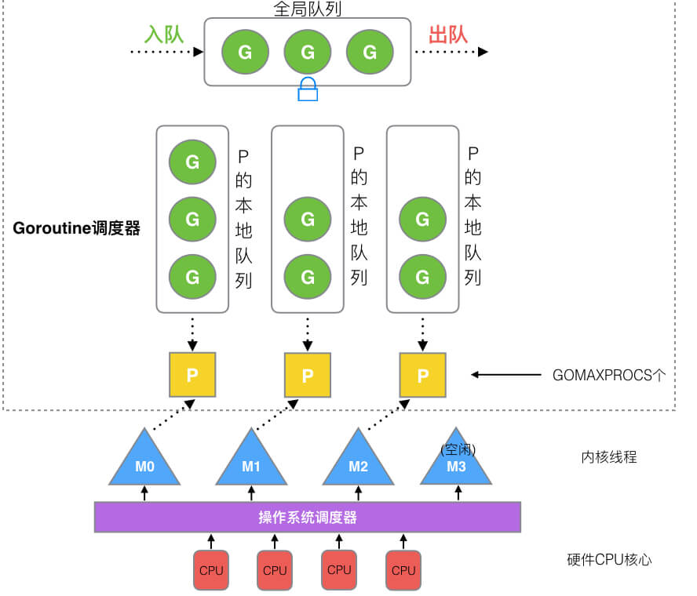

# GMP

具体流程

P-逻辑处理器：

G-Goroutine

M-thread线程：是执行P中的实体

1. **全局队列**（Global Queue）：存放等待运行的G，其来源主要有从系统调用中恢复的G
2. **P的本地队列**：同全局队列类似，存放的也是等待运行的G，存的数量有限，不超过256个。新建G’时，G’优先加入到P的本地队列，如果队列满了，则会把本地队列中一半的G移动到全局队列。
3. **P列表**：所有的P都在程序启动时创建，并保存在数组中，最多有`GOMAXPROCS`(可配置)个。
4. **M**：线程想运行任务就得获取P，从P的本地队列获取G，P队列为空时，M也会尝试从全局队列**拿**一批G放到P的本地队列，或从其他P的本地队列**偷**一半放到自己P的本地队列。M运行G，G执行之后，M会从P获取下一个G，不断重复下去。

## Goroutine调度
1. 队列轮转：
   1. 不考虑G进入系统调用或IO操作的情况下，P周期性的将G调度到M中执行，执行一小段时间，将上下文保存下来，然后将G放到队列尾部，然后从队列中重新取出一个G进行调度。每个P会周期性地查看全局队列中是否有G待运行并将其调度到M中执行
2. 系统调用：
   1. M0运行的某G0进入系统调用，M0释放P，进而某个空闲的M1获取P，继续执行P队列中剩下的G。而M0由于陷入系统调用而进被阻塞，M1接替M0的工作，只要P不空闲，就可以保证充分利用CPU

3. 工作量窃取
   1. 多个P中维护的G队列有可能是不均衡的。此时空闲P将其他P中G偷取一部分过来

## 高效的策略

- M是可以复用的，不需要反复创建与销毁，当没有可执行的Goroutine时候就处于自旋状态，等待唤醒
- 内存分配状态(mcache)位于P，G可以跨M调度，不再存在跨M调度局部性差的问题
- M从关联的P中获取G，不需要使用锁，是lock free的