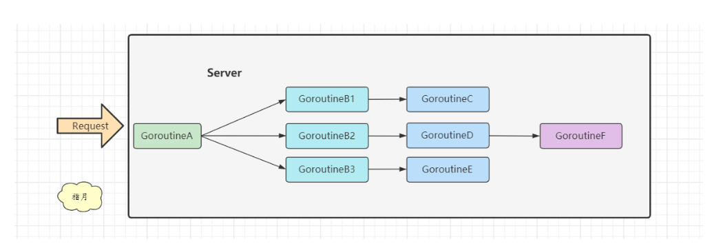

# Context

## 什么是go的context

context 主要用来在 goroutine 之间传递上下文信息，包括：取消信号、超时时间、截止时间、k-v 等，主要用于**超时控制**和**多Goroutine间的数据传递**

## context使用场景

**HTTP/RPC Server**

Go 的 server 里，通常每来一个请求都会启动若干个 goroutine 同时工作：有些去数据库拿数据，有些调用下游接口获取相关数据

而客户端一般不会无限制的等待，都会被请求设定超时时间，比如100ms。

比如这里GoroutineA消耗80ms，GoroutineB3消耗30ms，已经超时了，那么后续的GoroutineCDEF都没必要执行了，客户端已经超时返回了，服务端就算计算出结果也没有任何意义了。

所以这里就可以使用 Context 来在多个 Goroutine 之间进行超时信号传递

引入超时好处：

1. 客户端可以快速返回，提升用户体验
2. 服务端减少无效计算

## 注意事项
- context 的 Done() 方法往往需要配合 select {} 使用，以监听退出。
- 尽量通过函数参数来暴露 context，不要在自定义结构体里包含它。
- 直接将 Context 类型作为函数的第一参数，而且一般都命名为 ctx
- context 存储的应该是一些共同的数据。例如：登陆的 session、cookie 等
- WithValue 类型的 context 应该尽量存储一些全局的 data，而不要存储一些可有可无的局部 data。

- 一旦 context 执行取消动作，所有派生的 context 都会触发取消。