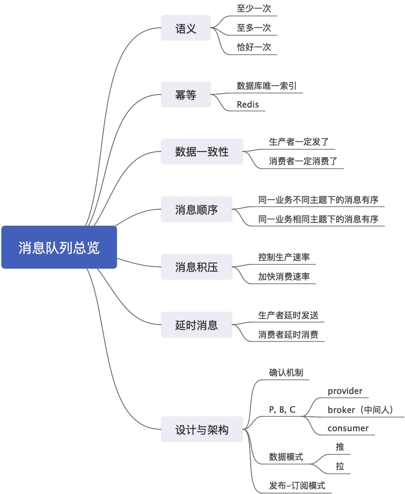

# 消息队列

支持高吞吐、高并发、高可用的队列

要理解这些问题，我们要先理解分布式调用语义：

1. 至少一次语义：是指消费者至少消费消息一次。这意味着存在重复消费的可能，解决思路就是幂等；
2. 至多一次语义：是指消费者至多消费消息一次。这意味着存在消息没有被消费的可能，基本上实际中不会考虑采用这种语义，只有在日志采集之类的，数据可以部分缺失的场景，才可能考虑这种语义；
3. 恰好一次语义：最严苛的语义，指消息不多不少恰好被消费一次；

绝大多数情况下，我们追求的都是**至少一次**语义，即生产者至少发送一次，可能重复发送；消费者至少消费一次，可能重复消费（虽然去重了，但是我们也认为消费了，只不过这个消费啥也没干）。结合之下，就能发现，只要解决了消费者重复消费的问题的，那么生产者发送多次，就不再是问题了。

有时候面试官也会将这种去重之后的做法称为“恰好一次”，所以面试的时候要注意一下，是可以用重试+去重来达成恰好一次语义的。

理解了这些，我们就解决了数据一致性的问题，即生产者一定发出去了消息，或者消费者一定消费了消息。

还有一些问题，我们会在具体的消息队列中间件上讨论，例如如何保证高可用，如何保证高性能。这些都是具体消息中间件相关的。

关键字：**一致性**，**幂等**，**顺序**

## 问题

### 你用消息队列做什么？

1. 解耦：将不同的系统之间解耦开来。尤其是当你在不希望感知到下游的情况。例如我们退款，会用消息队列来暴露我们的退款信息，比如说退款成功与否。很多下游关心，但是实际上，我们退款部门根本不关心有谁关心。在不使用消息队列的时候，我们就需要一个个循环调用过去；

2. 异步：是指将一个同步流程，利用消息队列来拆成多个步骤。这个特性被广泛应用在事件驱动之中。比如说在退款的时候，退款需要接入风控，多个款项资金转移，这些步骤都是利用消息队列解耦，上一个步骤完成，发出事件来驱动执行下一步；

3. 削峰：削峰主要是为了应对突如其来的流量。一般来说，数据库只能承受每秒上千的写请求，如果在这个时候，突然来了几十万的请求，那么数据库可能就会崩掉。消息队列这时候就起到一个缓冲的效果，服务器可以根据自己的处理能力，一批一批从消息队列里面拉取请求并进行处理。

关键字：**解耦**，**异步**，**削峰**

#### 类似问题

- 消息队列有什么作用
- 你为什么用消息队列
- 为什么不直接调用下游，而要使用消息中间件？这个基本上就是回答解耦，异步也勉强说得上，不过要点在解耦。
- 或者，面试官直接问道三个特性的某个，你是如何使用的

#### 如何引导

- 讨论到秒杀
- 讨论到事件驱动

### 消息队列有什么缺点？

答：

1. 可用性降低：引入任何一个中间件，或者多任何一个模块，都会导致你的可用性降低。（所以这个其实不是MQ的特性，而是所有中间件的特性）
2. 一致性难保证：引入消息队列往往意味着本地事务不可用，那么就容易出现数据一致性的问题。例如业务成功了，但是消息没发出去；
3. 复杂性上升：复杂性分两方面，一方面是消息队列集群维护的复杂性，一方面是代码的复杂性

（升华主题）几乎所有的中间件的引入，都会引起类似的问题。

关键字：**可用性**，**一致性**，**复杂性**

#### 如何引导
- 前面说完消息队列的好处之后，直接就可以接缺点

### 如何保证消息消费的幂等性？

答案：保证幂等性，主要依赖消费者自己去完成。一般来说，一条消息里面都会带上标记这一次业务的某些特征字段。核心就是利用这些字段来去重。比如说，最常见的是利用数据库的唯一索引来去重，要小心的就是，采用 `check - doSomething` 模式可能会有并发问题。

另外一种就是利用 Redis。因为你只需要处理一次，所以不必采用分布式锁的模式，只需要将超时时间设置得非常非常长。带来的不利影响就是Redis会有非常多的无用数据，而且万一真有消息在 Redis 过期之后又发过来，那还是会有问题。

#### 类似问题

- 如何保证消息只会被消费一次？
- 如何保证消息消费恰好一次语义？

关键字：**去重**，**Redis Set**, **唯一索引**

### 什么情况导致重复消费？

答案：

1. 从生产者到消息中间件之间，生产者可能重复发送。例如生产者发送过程中出现超时，因此生产者不确定自己是否发出去了，重试；
2. 消息中间件到消费者，也可能超时。即消息中间件不知道消费者消费消息了没有，那么重试就会引起重复消费。消息中间件不知道消费者消费消息了没有，又有两种子情况：

    2.1 消息传输到消费者的时候超时；

    2.2 消费者确认的时候超时；

关键字：**超时**

### 如何保证生产者只会发送消息一次？

答案：这个问题，可以拆成两个问题：如何保证消息一定发出去了？其次是如何保证只发了一次？

对于第一个问题来说，可以考虑分布式事务，或者重试机制。

开启分布式事务需要消息中间件的支持。

超时机制，核心就是超时处理 + 查询。如果在消息发送明确得到了失败的响应，那么可以考虑重试，超过重试次数就需要考虑人手工介入。

另外一种是超时处理，即你也不知道究竟成功了没。为了防止这种问题，可以考虑在发送消息之前，插入一条数据库待发送消息记录，这个插入要和前面的业务逻辑绑在一起作为一个本地事务。在发送成功、失败或者超时都标记对应的记录。带来的问题就是增加数据库的负担，并且后面更新记录的时候，依旧可能失败，最终还是无法保证生产一次。

而后开启一个定时任务，扫描超时的记录，然后重新发送。如果消息中间件支持查询，那么可以考虑查询一下上一次的究竟成功没有，否则就只能直接重试。

第二个问题：如何确保只发送一次？

从前面来看，分布式事务天然就能保证只发送一次。而超时机制，则完全无法保证。

（升华主题）其实我们追求的并不是消息恰好发送一次，而是消息至少发送一次，依赖于消费端的幂等性来做到恰好一次语义。

#### 类似问题

- 如何保证消息一定发出去了？
- 如何保证消息的可靠性传输？
- 如何保证消息的数据一致性？分生产者和消费者两方来回答
- 能不能依赖于消息ID来做重复消费的去重？
  
#### 如何引导
- 聊到如何确保消费一次。

### 如何保证消息顺序

可能指：

1. AB两台机器，A机器在实际上先于B机器发出来的消息，那么消费者一定先消费
2. 同一个业务（例如下单），先发出来的消息（例如创建订单消息）一定比后面发的消息（例如支付消息）先被消费
3. 不同业务，先发出来的消息的（例如支付消息）一定比后面发的消息（例如退款）先被消费。（实际中，支付和退款差不多都是分属两个部门）

第一个问题，涉及的是时钟问题，可以忽略，除非面到了中间件设计中时序处理的问题。

第二个问题，可以理解为同一个主题（topic），前后两条消息。这是一般意义上的消息顺序。

第三个问题，可以理解为不同主题（topic），前后两条消息。这是业务上的消息顺序。

所以，我们的回答就围绕：同一个业务的消息，如何保证顺序。

回答：一般原则上，保证消息顺序需要保证生产者投递过来的顺序是对的，消费者消费的顺序也是对的。大多数情况下，我们可以让相关消息都发送到同一个队列里面。例如，对于`Kafka`而言，我们可以让要求顺序的消息，都丢到同一个`Partition`里面。重要的是，`Kafka`的机制保证了，一个`Partition`只会有一个线程来消费，从而保证了顺序。

（要补充说明，`Partition`可以替换为队列等你所用的中间件的类似的概念）这里指的同一个`Partition`是指，相关的消息都到一个`Partition`，而不是指整个`topic`只有一个`Partition`。

（补充缺点）带来的问题是要慎重考虑负载均衡的问题，否则容易出现一个`Partition`拥挤的问题。而且它还限制了，同一个`Partition`只能被一个线程消费，而不能让一个线程取数据而后提交给线程池消费。

有些时候，我们需要自己重新排序收到的消息，比如说消息中间件不支持指定发送目的地（队列），或者消息属于不同的主题。（属于不同主题，就只能用这个方法）

在收到乱序之后的消息，可以选择两种做法：

1. 将消息转储到某个地方，例如扔过去数据库，放到`Redis`或者直接放在内存里面；
2. 让消息中间件过一段时间再发过来，期望再发过来的时候，前置消息已经被处理过了；

每次收到消息，都要检查是不是可以处理这个消息了，可以的话才处理。

（要考虑周详，容错问题）这种问题下，可能出现的是，某个前置消息一直没来，那么应该有一个告警机制。还要考虑到，这种已经被处理过的消息，是可以被清理掉的，以节省资源。

而如果我们要求不同主题的消息有顺序，例如某个业务会依次产生 A，B 两个消息，它们属于不同主题。那么这种情况下，第二种方法才能达到保证消息顺序的目的。

#### 类似问题
- 如何保证业务消息的顺序？要根据消息是否属于同一主题来回答，两个方面都要回答
- 如何保证管理消息的依赖性？
- 如何确保某个消息一定会先于别的消息执行？

#### 如何引导

- 在谈论到`Kafka`的`Partition`的时候（或者讨论到类似的东西的时候，可以简单提及可用这种性质来解决顺序问题）；

### 消息积压怎么办？

答案：整体上有两个思路：

1. 增加集群规模。不过这个只能治标，缓解问题，但是不能解决问题；
2. 加快单个消息的消费速率。例如原本同步消费的，可以变成异步消费。把耗时的操作从消费的同步过程里面摘出去；
3. 增加消费者。例如`Kafka`中，增加`Partition`，或者启用线程池来消费同一个`Partition`。

（刷亮点）其实消息积压要看是突然的积压，即偶然的，那么只需要扩大集群规模，确保突然起来的消息都能在消息中间件上保存起来，就可以了。因为后续生产者的速率回归正常，消费者可以逐步消费完积压的消息。如果是常态化的生产者速率大于消费者，那么说明容量预估就不对。这时候就要调整集群规模，并且增加消费者。典型的就是，`Kafka`增加新的`Partition`。

#### 类似问题

- 生产者发送消息太快怎么办？
- 消费者消费太慢怎么办？
- 怎么加快消费者消费速率？

### 如何实现延时消息？

答案：在消息中间件本身不支持延时消息的情况下，大体上有两种思路：

第一种思路是消息延时发送。生产者知道自己的消息要延时发送，可以考虑先存进去代发消息列表，而后定时任务扫描，到达时间就发送；也可以生产者直接发到一个特殊的主题，该主题的消费者会存储下来。等到时间到了，消费者再投递到准确的主题；

第二种思路是消息延时消费。消费者直接收到一个延时消息，发现时间点还没到，就自己存着。定时任务扫描，到时间就消费。

如果是消费者和生产者自己存储延时消息，那么意味着每个人都需要写类似的代码来处理延时消息。所以比较好的是借助一个第三方，而第三方的位置也有两种模式：
1. 第三方位于消息队列之前，第三方临时存储一下，后面再投递；
2. 第三方位于某个特殊主题之后，生产者统一发到该特殊主题。第三方消费该主题，临时存储，而后到点发送到准确主题；

