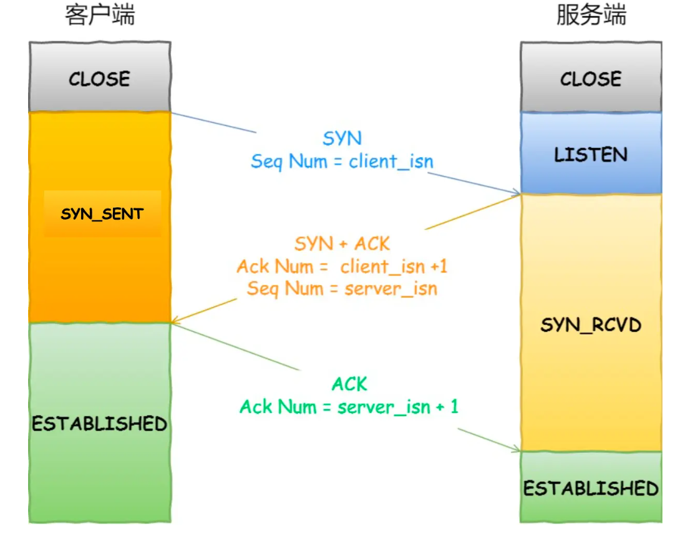
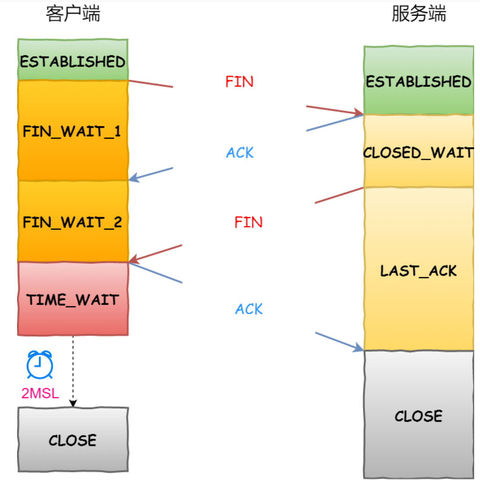

# 计算机网络
## OSI七层模型及其作用

1. 物理层：底层数据传输，如网线；网卡标准，**比特流**
2. 数据链路层：定义数据的基本格式，如何传输，如何标识；如网卡MAC地址，**此时数据是帧**
3. 网络层：定义IP选址，定义路由功能；**数据称为包**
4. 传输层：端到端传输数据的基本功能；如 TCP、UDP，**数据为段**
5. 会话层：控制应用程序之间会话能力；如不同软件数据分发给不同软件
6. 表示层：数据格式化，基本压缩加密功能。
7. 应用层：各种应用软件，包括 Web 应用

## TCP/IP五层模型

- 应用层
- 传输层
- 网络层
- 数据链路层
- 物理层

## TCP/IP协议分为5/7层原因

1. 隔层之间是独立的
2. 灵活性好
3. 结构上分隔开
4. 易于实现与维护
5. 促进标准化工作

## 一个完整HTTP请求过程/输入url显示网页的过程，包含物理设备
1. 键盘输入URL
   1. 按下键盘，一个用于该键的电流回路闭合，因此电流进入键盘的逻辑电路系统。这个逻辑电路系统检测到该按键的状态变化，将电流信号转换为键盘码值
   2. 键盘控制器得到码值后，将其编码，通过中断请求发送，OS的内核提供的中断处理器进行处理
   3. OS得到输入具体内容

2. 解析URL
   1. 按下回车：回车信号被操作系统捕获，解析URL的过程被触发
      1. 判断是url还是搜索关键字
         1. 首先会检测输入的URL的合法性。通过检测协议和主机名来进行合法性检测。如果不是一个合法的URL，浏览器则会将输入视为一个搜索关键字

      2. 检查HSTS列表（HTTP严格传输安全），包含了只能使用HTTPS来进行访问的网站
         1. 因为用户可能会发送HTTP请求，被服务器拒绝后，才会重新发送HTTPS请求。
         2. 而第一次的HTTP请求并不安全。浏览器内置的HSTS就可以一定程度的解决这个问题

      3. 转换非ASCII的字符，将其编码

3. 访问URL
   1. DNS查询
      1. 检查浏览器缓存、本地Hosts缓存、路由器缓存、本地域名服务器缓存
      2. 访问根域名，依次访问对应的顶级域名，最终获得对应访问目标IP
  2. ARP
     1. IP地址转MAC地址

4. Socket通信
   1. 找到确定位置，调用系统函数socket，请求TCP套接字，逐层处理封装
      1. 传输层将TCP请求封装成TCP报文
      2. 网络层主要将上一层生成的TCP报文进行处理，加入一个IP头部。封装成IP报文
      3. 链路层在IP报文外封装一个frame头部，包括了本地网卡的MAC地址以及网关的MAC地址等信息
      4. 物理层主要根据传输介质的不同，将报文转换为各种适于传输的格式

5. 三次握手

6. TLS/SSL握手
   1. 客户端发送一个Hello消息到服务器端，消息主要用来告知服务器端，客户端使用的TLS的版本，可用的加密算法和压缩算法。
   2. 服务器端返回一个Hello消息到客户端，消息用于确认通信将使用的TLS版本，加密算法和压缩算法。另外还包括服务器的公开证书以及其公钥。
   3. 客户端根据自己信任的CA列表，验证服务器端的证书是否有效。
   4. 如果证书有效，则客户端生成一个伪随机数，并根据伪随机数生成对称密钥，并使用使用服务器端提供的公钥加密它，并发送给服务器。至此TLS握手完成。
   5. 服务器使用私钥解密得到对称密钥，由此双方可以使用该对称密钥进行安全通信

7. HTTP协议
   1. 通过TLS建立安全的TCP连接后，则可以通过HTTP请求来进行数据的传输了
      1. HTTP请求包
         1. 请求类型
         2. 头部放入响应文件类型、是否保持TCP连接、浏览器保持的cookie

      2. HTTP响应包
         1. 状态码、响应内容编码方式、内容长度

8. 四次挥手

9. 浏览器解析并渲染
   1. 收到HTTP响应文件后，执行以下操作
      1. 解析HTMPL、CSS、JS
      2. 渲染布局、绘制

先后用到的知识：DNS、TCP三次握手、HTTP、TCP四次挥手

### 介绍DNS

- 域名系统：通过主机名，最终得到该主机名对应的IP地址
- **应用层协议**，传输层采用**UDP**
  - 采用UDP原因
    - 速度快，只要一个请求和一个应答。且DNS服务器返回的内容不超过512字节，UDP足够使用
- 工作原理
  - 用户输入域名时，浏览器先检查自己的缓存中是否 这个域名映射的ip地址，有解析结束
  - 若没命中，则检查操作系统缓存（如Windows的hosts）中有没有解析过的结果，有解析结束
  - 若无命中，则请求本地域名服务器解析（ LDNS）
  - 若LDNS没有命中就直接跳到根域名服务器请求解析。根域名服务器返回给LDNS一个 顶级域名服务器地址
  - 此时LDNS再发送请求给上一步返回的gTLD（ 通用顶级域）， 返回这个域名对应的Name Server的地址
  -  Name Server根据映射关系表找到目标ip，返回给LDNS
  -  LDNS缓存这个域名和对应的ip， 把解析的结果返回给用户，用户缓存到本地系统缓存中，域名解析过程至此结束

### HTTP长连接与短连接区别

- HTTP/1.0中默认使用短连接。也就是说，客户端和服务器每进行一次HTTP操作，就建立一次连接，任务结束就中断连接
- 从HTTP/1.1起，默认使用长连接，用以保持连接特性

### HTTP的请求方法

- HTTP1.0 定义了三种请求方法： GET, POST 和 HEAD方法（引出GET与POST区别
- HTTP1.1 新增了六种请求方法：OPTIONS、PUT、PATCH、DELETE、TRACE 和 CONNECT 方法

#### GET与POST区别

- get是获取数据，post是修改数据
- get把请求的数据放在url上，post把数据放在HTTP的包体内
-  get提交的数据最大是2k（ 限制实际上取决于浏览器）， post理论上没有限制
- GET产生一个TCP数据包，浏览器会把http header和data一并发送出去，服务器响应200(返回数据)
  - POST产生两个TCP数据包，浏览器先发送header，服务器响应100 continue，浏览器再发送data，服务器响应200 ok(返回数据)
- GET请求会被浏览器主动缓存，而POST不会，除非手动设置

### TCP三次握手（重点）
- 图示
  - 

#### 为什么三次握手

若使用两次握手，则出现以下：

- 客户端发出连接请求，但因连接请求报文丢失而未收到确认，于是客户端再重传一次连接请求
- 客户端收到了确认，建立了连接。数据传输完毕后，就释放了连接，客户端共发出了两个连接请求报文段，其中第一个丢失，第二个到达了服务端

第一个丢失的报文段只是在**某些网络结点长时**间滞留了，延误到连接释放以后的某个时间才到达服务端，此时服务端误认为客户端又发出一次新的连接请求，于是就向客户端发出确认报文段，同意建立连接，不采用三次握手，只要服务端发出确认，就建立新的连接了，此时客户端忽略服务端发来的确认，也不发送数据，则服务端一致等待客户端发送数据，浪费资源

#### 半连接队列域全连接队列

- 服务器第一次收到客户端的 SYN 之后，就会处于 SYN_RCVD 状态，此时双方还没有完全建立其连接，服务器会把此种状态下请求连接放在一个**队列**里，我们把这种队列称之为**半连接队列**
- **全连接队列**，就是已经完成三次握手，建立起连接的就会放在全连接队列中。如果队列满了就有可能会出现丢包现象

#### 三次握手可否携带数据

第三次握手的时候，是可以携带数据的。但是，**第一次、第二次握手不可以携带数据**

第一次握手可以携带数据的话，如果有人要恶意攻击服务器，那他每次都在第一次握手中的 SYN 报文中放入大量的数据。因为攻击者根本就不理服务器的接收、发送能力是否正常，然后疯狂着重复发 SYN 报文的话，这会让服务器花费很多时间、内存空间来接收这些报文

**第一次握手不可以放数据，其中一个简单的原因就是会让服务器更加容易受到攻击了。而对于第三次的话，此时客户端已经处于ESTABLISHED** 状态。对于客户端来说，他已经建立起连接了，并且也已经知道服务器的接收、发送能力是正常的了，所以能携带数据

### TCP四次挥手
图示：

1. 第一次挥手：**告诉服务端，客户端所有数据已经全发完了**，**服务端你可以关闭接收了**，但是如果你们服务端有数据要发给客户端，客户端照样可以接收的
2. 第二次挥手：服务端接收到客户端的释放请求连接之后，**知道客户端没有数据要发给自己了**，**然后服务端发送**ACK = 1告诉客户端收到你发给我的信息**，此时服务端处于 CLOSE_WAIT 等待关闭状态
3. 第三次挥手：服务端向客户端把所有的数据发送完了，然后发送一个FIN = 1，**用于告诉客户**端，服务端的所有数据发送完毕**，**客户端你也可以关闭接收数据连接了**。此时服务端状态处于LAST_ACK状态，来等待确认客户端是否收到了自己的请求
4. 第四次挥手：如果客户端收到了服务端发送完的信息之后，就发送ACK = 1，告诉服务端，客户端已经收到了你的信息。**有一个** **2 MSL** **的延迟等待**
   1. 意义：保证客户端发送的最后一个ACK报文段能够到达服务端。这个ACK报文段有可能丢失，使得处于LAST-ACK状态的B收不到对已发送的FIN+ACK报文段的确认。客户端在2MSL时间内收到这个重传的FIN+ACK报文段，接着客户端重传一次确认，重新启动2MSL计时器，最后客户端和服务端都进入到CLOSED状态
   2. 使本连接持续的时间内所产生的所有报文段都从网络中消失，使下一个新的连接中不会出现这种旧的连接请求报文段

#### 为什么四次挥手

当服务端收到客户端的SYN连接请求报文后，可以直接发送SYN+ACK报文。其中**ACK报文是用来应答的，SYN报文是用来同步的**。

关闭连接时，当服务端收到FIN报文时，很可能并不会立即关闭SOCKET，所以只能先回复一个ACK报文，告诉客户端，"你发的FIN报文我收到了"。只有等到我服务端所有的报文都发送完了，我才能发送FIN报文，因此不能一起发送。故需要四次挥手

#### 为什么Time_WAIT需要等待2MSL才能返回到close状态

- **TIME_WAIT 状态就是用来重发可能丢失的 ACK 报文** 
- 原因是，担心网络不可靠而导致的丢包，最后一个回应 B 的 ACK 万一丢了怎么办，在这个时间内，A 是可以重新发包的，但是超过了最大等待时间的话，就算收不到也没用了，所以就可以关闭了。

#### 服务器出现大量close_wait，原因、解决方法

close_wait状态是在TCP四次挥手的时候收到FIN但是没有发送自己的FIN时出现的

原因：

1. 服务器内部业务处理占用了过多时间，都没能处理完业务；或者还有数据需要发送；或者服务器的业务逻辑有问题，没有执行close()方法
2. 服务器的父进程派生出子进程，子进程继承了socket，收到FIN的时候子进程处理但父进程没有处理该信号，导致socket的引用不为0无法回收

解决方案：

1. 停止应用程序
2. 修改程序里的bug

## TCP粘包/拆包及其原因

- 一个完整的业务可能会被TCP拆分成多个包进行发送，也有可能把多个小的包封装成一个大的数据包发送，这个就是TCP的拆包和粘包问题
- 粘包：发送方发送数据包的长度和接收方在缓存中读取的数据包长度不一致，就会发生粘包，发送端可能堆积了两次数据，每次100字节一共在发送缓存堆积了200字节的数据，而接收方在接收缓存中一次读取120字节的数据，这时候接收端读取的数据中就包括了下一个报文段的头部，造成了粘包。
- 原因
  - 应用程序写入数据的字节大小大于套接字发送缓冲区的大小
  - 进行MSS大小的TCP分段。( MSS=TCP报文段长度-TCP首部长度) 
  - 以太网的payload大于MTU进行IP分片
- 解决
  - 消息定长
  - 包尾部增加回车或者空格符等特殊字符进行分割
  - 将消息分为消息头和消息尾

## HTTP与HTTPS区别

分析，此问题引出ssl/tls和证书等相关安全知识

Http缺点

1. 使用明文进行通信，内容可能会被窃听
2. 不验证通信方的身份，通信方的身份有可能遭遇伪装
3. 无法证明报文的完整性，报文有可能遭篡改

区别：

1. HTTP协议传输的数据都是未加密的，也就是明文的； 
2. HTTPS协议是由SSL+HTTP协议构建的可进行加密传输、身份认证的网络协议，更加安全
3. https协议需要到ca申请证书，一般免费证书较少，因而需要一定费用
4. http和https使用的是完全不同的连接方式，用的端口也不一样，前者是80，后者是443

### 什么是SSL/TLS

- SSL代表安全套接字层，用于加密和验证应用程序（如浏览器）和Web服务器之间发送的数据的协议
- 作用：认证用户和服务，加密数据，维护数据的完整性的应用层协议加密和解密需要两个不同的密钥，故被称为非对称加密；加密和解密都使用同一个密钥的

### HTTPS如何保证数据传输的安全

- 客户端向服务器端发起SSL连接请求
- 服务器把公钥发送给客户端，并且服务器端保存着唯一的私钥
- 客户端用公钥对双方通信的对称秘钥进行加密，并发送给服务器端
- 服务器利用自己唯一的私钥对客户端发来的对称秘钥进行解密
- 进行数据传输，服务器和客户端双方用公有的相同的对称秘钥对数据进行加密解密，可以保证在数据收发过程中的安全，即是第三方获得数据包，也无法对其进行加密，解密和篡改

### 如何保证公钥不被篡改

1. 公钥放在数字证书中。只要证书是可信的，公钥就是可信的。
2. 证书：
   1. 服务器的运营人员向数字认证机构 CA 提出公开密钥的申请，CA 在判明提出申请者的身份之后，会对已申请的公开密钥做数字签名，然后分配这个已签名的公开密钥，并将该公开密钥放入公开密钥证书后绑定在一起
   2. 进行 HTTPS 通信时，服务器会把证书发送给客户端。客户端取得其中的公开密钥之后，先使用数字签名进行验证，如果验证通过，就可以开始通信了

## HTTP请求与响应报文有哪些主要字段

- 请求
  1. 请求行：包含请求方法、请求目标、版本号
  2. 头部字段
  3. 请求体
- 响应
  1. 状态行：版本号、状态码、原因
  2. 头部字段
  3. 响应体

HTTP/1.1 里唯一要求必须提供的头字段是 Host，它必须出现在请求头里，标记虚拟主机名

## cookie是什么

- HTTP是无状态协议，引入cookie保存状态信息
- 是**服务器发送到用户浏览器并保存在本地的一小块数据**，它会在浏览器之后向同一服务器再次发起请求时被携带上，用于告知服务端两个请求是否来自同一浏览器

## session是什么

- 存储在服务器端/数据库、文件、内存等
- 维护登录状态的过程
  - 用户进行登录时，用户提交包含用户名和密码的表单，放入 HTTP 请求报文中
  - 服务器验证该用户名和密码，如果正确则把用户信息存储到 Redis 中，它在 Redis 中的 Key 称为Session ID
  - 服务器返回的响应报文的 Set-Cookie 首部字段包含了这个 Session ID，客户端收到响应报文之后将该Cookie 值存入浏览器中
  - 客户端之后对同一个服务器进行请求时会包含该 Cookie 值，服务器收到之后提取出 Session ID，从Redis 中取出用户信息，继续之前的业务操作

### cookie与session区别

1. Cookie是客户端保持状态的方法；Session是服务器保持状态的方法

2. 存储数据大小限制不同

   1. cookie：大小受浏览器的限制，很多是是4K的大小，
   2.  session：理论上受当前内存的限制

3. 使用场景

   1. Cookie 只能存储 ASCII 码字符串，而 Session 则可以存储任何类型的数据，因此在考虑数据复杂性时首选 Session
   2. 对于大型网站，如果用户所有的信息都存储在 Session 中，那么开销是非常大的，因此不建议将所有的用户信息都存储到 Session 中
   3. Cookie 存储在浏览器中，容易被恶意查看。如果非要将一些隐私数据存在 Cookie 中，可以将 Cookie 值进行加密，然后在服务器进行解密

   
## ARP

实现将IP地址解析为MAC地址

过程：

1. Host_1会查找自己本地缓存的ARP表，确定是否包含Host_3对应的ARP表项。如果有，帧封装发送；如果没有，转到2
2. 先缓存该数据报文，并以广播方式发送一个ARP请求报文。包含源MAC地址与源IP地址，目的MAC为0的地址和目的IP地址
3. 被请求主机处理该报文，将ARP请求报文中的源IP地址和源MAC地址存入自己的ARP表中，以单播方式发送ARP应答报文给Host_1
4. Host_1收到应答报文，其中MAC地址加入到自己的ARP表中以用于后续报文的转发，同时将数据报文进行帧封装，并将数据报文发送给目的主机

## 什么是RARP

1. 反向地址转换协议，网络层协议，RARP与ARP工作方式相反
2. RARP发出要反向解释的物理地址并希望返回其IP地址，应答包括能够提供所需信息的RARP服务器发出的IP地址

## DDos攻击

- 客户端向服务端发送请求链接数据包，服务端向客户端发送确认数据包，客户端不向服务端发送确认数据包，服务器一直等待来自客户端的确认
- 无法根治，除非不使用TCP
- 预防
  - 限制同时打开SYN半链接的数目
  - 缩短SYN半链接的Time out 时间

## 应用层常见协议及其端口

| 协议  | 默认端口 | 底层协议                                        |
| ----- | -------- | ----------------------------------------------- |
| HTTP  | 80       | TCP                                             |
| HTTPS | 443      | TCP                                             |
| DNS   | 53       | 服务器进行域传输用TCP，客户端查询DNS服务器用UDP |

## 对称加密域非对称加密

1. 对称密钥加密：加密和解密使用同一密钥
   1. 运算速度快
   2. 无法安全地将密钥传输给通信方
2. 非对称加密：**通信发送方获得接收方的公开密钥之后，就可以使用公开密钥进行加密**，**接收方收到通信内容后使用私有密钥解密**

## 网络层协议

| 协议                   | 作用                                                     |
| ---------------------- | -------------------------------------------------------- |
| IP                     | 定义数据传输基本单元与格式，定义数据报递交方法和路由选择 |
| ICMP（网络控制报文协议 | 检测网络的连线情况，是ping和traceroute工作协议           |

## SYN Flood，如何解决

客户端发送三次握手的第一个 SYN 报文后收到服务器的报文却不回应，从而导致服务器的半开资源浪费直到超时释放

可以使用 SYN Cookie，即通过将源目地址及 IP 地址和端口号哈希为序列号，将返回的 ACK-1 得到原来的序列号判断是否正确，直到连接建立才分配资源

## TCP四大拥塞控制算法

1. 慢启动
   - 连接建好的开始先初始化拥塞窗口cwnd大小为1，表明可以传一个MSS（最大分节字节）大小的数据
   - 每当过了一个往返延迟时间RTT(Round-Trip Time)，cwnd大小直接翻倍，乘以2，呈指数让升
   - 阻止拥塞窗口cwind的增长引起网络拥塞，还需要另外一个变量—慢开始门限ssthresh（slow start threshold），是一个上限，当cwnd >= ssthresh时，就会进入“拥塞避免算法”
2. 拥塞避免算法
   - 收到一个ACK，则cwnd = cwnd + 1 / cwnd，线性增加
   - 每当过了一个往返延迟时间RTT，cwnd大小加一
3. 判断拥塞发送状态
   - 超时重传
   - 受到三个重复确认ACK
     - 两次ACK可能是因为乱序造成
       - 具体解释
         - 以A方发送，B方接收报文为例。观察其中第N-1个报文到达B方后，B方的答复。B收到第N-1报文后，就会答复1个ACK号为N的ACK报文，此时如果收不到序列号为N的报文，则会继续发送第2个ACK号为N的答复报文，此为重复ACK。如果一直收不到对方序列号为N的报文，则会出现三次冗余的ACK，则意味着很大可能出现丢包了
     - 三次重复ACK可能是丢包
4. 快速恢复
   - 在进入快速恢复之前，cwnd和ssthresh已经被更改为原有cwnd的一半
   - cwnd = cwnd + 3 *MSS*，加*3* MSS的原因是因为收到3个重复的ACK
   - 重传ACKs指定的数据包
   - 如果再收到ACKs，那么cwnd大小增加一
   - 如果收到新的ACK，表明重传的包成功了，那么退出快速恢复算法。将cwnd设置为ssthresh，然后进入拥塞避免算法

## TCP协议如何保证可靠传输

- **确认和重传**：接收方收到报文就会确认，发送方发送一段时间后没有收到确认就会重传
- **数据校验**：TCP报文头有校验和，用于校验报文是否损坏
- **数据合理分片和排序**：tcp会按最大传输单元(MTU)合理分片，接收方会缓存未按序到达的数据，重新排序后交给应用层
- **流量控制**：当接收方来不及处理发送方的数据，能通过滑动窗口，提示发送方降低发送的速率，防止包丢失
- **拥塞控制**：当网络拥塞时，通过拥塞窗口，减少数据的发送，防止包丢失

## UDP协议如何保证可靠传输

应用层模仿TCP的可靠性传输

- 1、添加seq/ack机制，确保数据发送到对端
- 2、添加发送和接收缓冲区，主要是用户超时重传。
- 3、添加超时重传机制。

目前有如下开源程序利用udp实现了可靠的数据传输。分别为 **RUDP、RTP、UDT**

UDT（基于UDP的数据传输协议）建于UDP之上，并引入新的拥塞控制和数据可靠性控制机制。UDT是面向连接的双向的应用层协议。它同时支持可靠的数据流传输和部分可靠的数据报传输

## TCP封包和拆包

- 封包和拆包都是基于TCP的概念。因为TCP是无边界的流传输，所以需要对TCP进行封包和拆包，确保发送和接收的数据不粘连
  - 封包就是在发送数据报的时候为每个TCP数据包加上一个包头
  - 拆包：接收方在接收到报文后提取包头中的长度信息进行截取

## TCP、UDP特点

UDP：

- UDP是**无连接的**；
- UDP使用**尽最大努力交付**，即不保证可靠交付，因此主机不需要维持复杂的链接状态
- UDP是**面向报文**的
- UDP**没有拥塞控制**
- UDP**支持一对一、一对多、多对一和多对多**的交互通信
- UDP的**首部开销小**，只有8个字节，比TCP的20个字节的首部要短

TCP：

- **TCP是面向连接的**。
- 每一条TCP连接只能有两个端点，每一条TCP连接只能是点对点的（**一对一**）
- TCP**提供可靠交付的服务**
- TCP**提供全双工通信**
- **面向字节流**

## TCP与UDP各自对应的应用层协议

- TCP
  1. FTP：文件传输协议，21端口传输，20端口控制哦
  2. Telnet：远程登录协议，23端口
  3. SMTP：简单邮件传输协议，25端口
  4. POP3：接收邮件
  4. SSH：22端口
- UDP
  1. DNS：域名解析服务，53端口
  2. SNMP：简单网络管理协议，161端口

## RTO、RTT与超时重传是什么

1. 超时重传：发送端发送报文后若长时间未收到确认的报文则需要重发该报文
   1. 发送的数据没能到达接收端，所以对方没有响应
   2. 接收端接收到数据，但是ACK报文在返回过程中丢失
   3. 接收端拒绝或丢弃数据
2. RTO：从上一次发送数据，因为长期没有收到ACK响应，到下一次重发之间的时间。就是重传间隔
3. RTT：数据从发送到接收到对方响应之间的时间间隔，即数据报在网络中一个往返用时

## 常见HTTP状态码

- 1xx：提示信息，协议处理中间状态
- 2xx：服务器收到并成功处理客户端请求
- 3xx：客户端请求的资源发生了变动，客户端必须用新的 URI 重新发送请求获取资源
- 4xx：客户端发送的请求报文有误，服务器无法处理
- 5xx：服务器在处理时内部发生了错误，无法返回应有的响应数据

**100 continue**：表明到目前为止都很正常，客户端可以继续发送请求或者忽略这个响应

**200 OK**：服务器如客户端所期望的那样返回了处理结果，如果是非 HEAD 请求，通常在响应头后都会有 body 数据

**204 No Context**：请求已经成功处理，但是返回的响应报文不包含实体的主体部分

**301 Moved Permanently**：永久性重定向，改用新的 URI 再次访问

**302 Found** ：临时性重定向

**400 Bad Request** ：请求报文中存在语法错误

**401 Unauthorized** ：该状态码表示发送的请求需要有认证信息（BASIC 认证、DIGEST 认证）。如果之前已进行过一次请求，则表示用户认证失败

**403 Forbidden** ：请求被拒绝

**404 Not Found**：资源在本服务器上未找到，所以无法提供给客户端

**500 Internal Server Error** ：服务器正在执行请求时发生错误

**503 Service Unavailable** ：服务器暂时处于超负载或正在进行停机维护，现在无法处理请求

## 有IP地址，为什么还用MAC地址

1.IP地址是有限的，根本就不够用，不可能为全球每台计算机都分配一个IP地址。
2.MAC地址全球固定而且唯一的，有了MAC地址就能准确的找到你的计算。
3.如果IP层抢了第二层的饭碗，你就不得不考虑第二层的很多东西了，这就让IP层的实现变得十分困难

## 有MAC地址，还需要IP地址吗

Mac地址是物理层的地址，但它是以太网的物理地址。互联网是由很多异构的物理网络通过路由器联接起来的，不同的物理网络，寻址方式很可能是不同的，可能根本不使用MAC地址。如果只用MAC地址，不同的物理网络进行寻址时会非常困难，因为彼此的数据帧格式不一样相互不兼容。所以，我们需要一个公用的标准去遵循，这个标准就是IP地址

## SYN攻击

SYN攻击就是Client在短时间内伪造大量不存在的IP地址，并向Server不断地发送SYN包，Server则回复确认包，并等待Client确认，由于源地址不存在，因此Server需要不断重发直至超时，这些伪造的SYN包将长时间占用未连接队列，导致正常的SYN请求因为队列满而被丢弃，从而引起网络拥塞甚至系统瘫痪

netstats -n -p TCP | grep SYN_RECV检测

防御“

- 缩短超时时间
- 增加最大半连接数
- 过滤网关防护
- SYN cookies技术

## 一个TCP连接中，HTTP请求发送可以一起发送吗

- HTTP/1.0 存在一个问题，单个 TCP 连接在同一时刻只能处理一个请求，任意两个 HTTP 请求从开始到结束的时间在同一个 TCP 连接里不能重叠
- HTTP/1.1 存在 Pipelining 技术可以完成这个多个请求同时发送，但是由于浏览器默认关闭，所以可以认为这是不可行的
  - 通过以下提高页面加载效率
    - 维持和服务器已经建立的 TCP 连接，在同一连接上顺序处理多个请求
    - 和服务器建立多个 TCP 连接
- 在 HTTP2 中由于 Multiplexing 特点的存在，多个 HTTP 请求可以在同一个 TCP 连接中并行进行

## HTTP 1.0/1.1/2.0/3.0区别

- HTTP 1.0

  - 无状态，无连接的应用层协议。 HTTP1.0规定浏览器和服务器保持短暂的链接
  - 每次请求都需要与服务器建立一个TCP连接，服务器处理完成以后立即断开TCP连接(无连接)，服务器不跟踪也每个客户单，也不记录过去的请求(无状态)
  - 问题：
    - 无法复用连接
    - TCP 连接的新建成本很高，因为需要客户端和服务器三次握手，并且开始时发送速率较慢（slow start）

- HTTP 1.1

  - 保持HTTP连接不断
  - 可以使用管道传输，多个请求可以同时发送，但是服务器还是按照顺序，先回应 A 请求，完成后再回应 B 请求。要是 前面的回应特别慢，后面就会有许多请求排队等着。这称为**「队头堵塞」**

- HTTP 2.0

  - 多路复用(链接共享)— 真并行传输
    - 同域名下所有通信在单个连接（流）上完成，该连接可用承载任意数量的双向数据流
    - 所有HTTP2.0通信都在一个TCP链接上完成，这个链接可以承载任意流量的双向数据流
    - 数据流以消息发送，消息由多个帧组成
    - 多路复用(连接共享)可能会导致关键字被阻塞，HTTP2.0里每个数据流都可以设置优先级和依赖，优先级高的数据流会被服务器优先处理和返回客户端，数据流还可以依赖其他的子数据流
  - 头部压缩
    - 服务器和客户端之间建立哈希表，将用到的字段存放在这张表中，那么在传输的时候对于之前出现过的值，只需要把**索引**(比如0，1，2，...)传给对方即可，对方拿到索引查表
    - 于整数和字符串进行**哈夫曼编码**，哈夫曼编码的原理就是先将所有出现的字符建立一张索引表，然后让出现次数多的字符对应的索引尽可能短，传输的时候也是传输这样的**索引序列**，可以达到非常高的压缩率

- HTTP 3.0
  - 基于QUIC实现
    - 基于udp实现的，实现了可靠传输；
    - 内含了 TLS1.3，只能加密通信，支持 0-RTT 快速建连
    - 连接使用“不透明”的连接 ID，不绑定在“IP 地址 + 端口”上，支持“连接迁移”

  - 什么是0-RTT建连?

    - 传输层0-RTT就能建立连接
    - 加密层0-RTT就能建立加密连接

  - 缓存当前会话的上下文，下次恢复会话的时候，只需要将之前的缓存传递给服务器，验证通过，就可以进行传输了

    减少了tcp三次握手时间，以及tls握手时间；

    解决了http 2.0中前一个stream丢包导致后一个stream被阻塞的问题；

    优化了重传策略，重传包和原包的编号不同，降低后续重传计算的消耗；

    连接迁移，不再用tcp四元组确定一个连接，而是用一个64位随机数来确定这个连接；

    更合适的流量控制。

## TCP流量控制原理(滑动窗口)

- 目的是接收方通过TCP头窗口字段告知发送方本方可接收的最大数据量，用以解决发送速率过快导致接收方不能接收的问题。所以流量控制是点对点控制
- TCP是双工协议，双方可以同时通信，所以发送方接收方各自维护一个发送窗和接收窗
  - 发送窗：用来限制发送方可以发送的数据大小，其中发送窗口的大小由接收端返回的TCP报文段中窗口字段来控制，接收方通过此字段告知发送方自己的缓冲（受系统、硬件等限制）大小
  - 接收窗：用来标记可以接收的数据大小
- TCP是流数据，发送出去的数据流可以被分为以下四部分：
  - 已发送且被确认部分 | 
  - 已发送未被确认部分 | 
  - 未发送但可发送部分 | 
  - 不可发送部分
  - 其中发送窗 = 已发送未确认部分 + 未发但可发送部分。接收到的数据流可分为：已接收 | 未接收但准备接收 | 未接收不准备接收。接收窗 = 未接收但准备接收部分
- 发送窗内数据只有当接收到接收端某段发送数据的ACK响应时才移动发送窗，左边缘紧贴刚被确认的数据。
- 接收窗也只有接收到数据且最左侧连续时才移动接收窗口

## 流量控制与拥塞控制区别

流量控制是**端到端**的控制，例如A通过网络给B发数据，A发送的太快导致B没法接收(B缓冲窗口过小或者处理过慢)，这时候的控制就是流量控制，原理是通过滑动窗口的大小改变来实现。 
拥塞控制是A与B之间的网络发生堵塞导致传输过慢或者丢包，来不及传输。防止过多的数据注入到网络中，这样可以使网络中的路由器或链路不至于过载。拥塞控制是一个全局性的过程，**涉及到所有的主机、路由器，以及与降低网络性能有关的所有因素**

## HTTP特点及其缺点

HTTP 的特点概括如下:

1. 灵活可扩展，主要体现在两个方面。一个是语义上的自由，只规定了基本格式，比如空格分隔单词，换行分隔字段，其他的各个部分都没有严格的语法限制。另一个是传输形式的多样性，不仅仅可以传输文本，还能传输图片、视频等任意数据，非常方便。
2. 可靠传输。HTTP 基于 TCP/IP，因此把这一特性继承了下来。这属于 TCP 的特性，不具体介绍了。
3. 请求-应答。也就是`一发一收`、`有来有回`， 当然这个请求方和应答方不单单指客户端和服务器之间，如果某台服务器作为代理来连接后端的服务端，那么这台服务器也会扮演**请求方**的角色。
4. 无状态。这里的状态是指**通信过程的上下文信息**，而每次 http 请求都是独立、无关的，默认不需要保留状态信息。

HTTP缺点：

1. 无状态：
   1. 在需要长连接的场景中，需要保存大量的上下文信息，以免传输大量重复的信息，那么这时候无状态就是 http 的缺点
   2. 外一些应用仅仅只是为了获取一些数据，不需要保存连接上下文信息，无状态反而减少了网络开销，成为了 http 的优点
2. 明文传输
   1. 协议里的报文(主要指的是头部)不使用二进制数据，而是文本形式
   2. `WIFI陷阱`就是利用 HTTP 明文传输的缺点，诱导你连上热点，然后疯狂抓你所有的流量，从而拿到你的敏感信息
3. 队头阻塞
   1. 当 http 开启长连接时，共用一个 TCP 连接，同一时刻只能处理一个请求，那么当前请求耗时过长的情况下，其它的请求只能处于阻塞状态，也就是著名的**队头阻塞**问题

## HTTP1.1如何解决HTTP的队头阻塞问题

- 并发连接：允许客户端最多并发2个连接，在现在浏览器标准中，上限更高
- 域名分片：一个`sanyuan.com`域名下可以分出非常多的二级域名，而它们都指向同样的一台服务器，能够并发的长连接数更多了，事实上也更好地解决了队头阻塞的问题

## 负载均衡

负载均衡：将工作负载分布到多个服务器来提高网站、应用、数据库或其他服务的性能和可靠性

在后端引入一个负载均衡器和至少一个额外的 web 服务器，可以缓解这个故障。通常情况下，所有的后端服务器会保证提供相同的内容，以便用户无论哪个服务器响应，都能收到一致的内容。

### 4层负载均衡

因其工作在OSI模型的传输层

基于IP+端口

#### 调度算法

1. 所有请求平均分配到每个真实服务器
2. 给每个后端服务器一个权值比例，将请求按照比例分配
3. 把新连接请求分配到当前连接数最小的服务器
4. 一致性哈希：仅影响故障服务器上连接session

### 7层负载均衡

七层负载均衡一般是基于请求URL地址的方式进行代理转发

#### 设备

- Nginx

特点

1. 热部署，可以在线升级
2. 内存消耗低
3. 事件驱动：异步非阻塞模型，mmap（内存映射）
   1. 一个进程/线程处理多个连接/请求异步非阻塞模型，减少OS进程切换

多个客户端给服务器发送的请求，Nginx服务器接收到之后，按照一定的规则分发给了后端的业务处理服务器进行处理了

具体哪个服务器不明确

## NAT

用以解决IPv4空间不足的问题，

私网用户访问公网的报文到达网关设备后，如果网关设备上部署了NAT功能，设备会将收到的IP数据报文头中的IP地址转换为另一个IP地址，端口号转换为另一个端口号之后转发给公网

设备可以用同一个公网地址来转换多个私网用户发过来的报文，并通过端口号来区分不同的私网用户，从而达到地址复用的目的